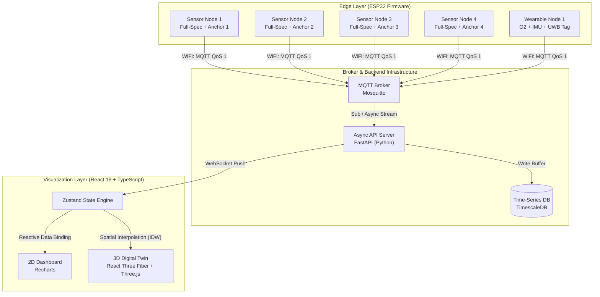

# SYSTEM ARCHITECTURE — 시스템 아키텍처

| 항목 | 내용 |
|------|------|
| 문서명 | 시스템 아키텍처 설계서 |
| 버전 | v2.0 |
| 상태 | 확정 |
| 최종 수정일 | 2026-07-13 |

---

## 1. 전체 시스템 구성도



---

## 2. 컴포넌트 역할

### 2.1 센서 노드 x 4 (Full-Spec, UWB Anchor)

| 항목 | 내용 |
|------|------|
| MCU | ESP32 DevKitC V4 |
| 측정 데이터 | CO2 (MH-Z19B), CO (MQ-7), H2S (MQ-136), 가스저항/IAQ (BME680), 가연성 가스 (MQ-2), 온도/습도/기압 (BME680) |
| ADC | ADS1115 -- MQ 센서 아날로그값 16-bit 변환 |
| UWB 역할 | **앵커** -- 웨어러블 태그와 DS-TWR 거리 측정 |
| 통신 | WiFi -> MQTT publish |
| 발행 주기 | CO2 1초, MQ 계열 1초, 온습도 5초, 노드 상태 10초 |

### 2.2 웨어러블 노드 x 1 (UWB Tag)

| 항목 | 내용 |
|------|------|
| MCU | ESP32 DevKitC V4 |
| 측정 데이터 | O2 농도 (SEN0322), 가속도/자이로 (MPU-6050) |
| 낙상 감지 | 합성 가속도벡터 >= 2.5g + 1초 이상 정적 상태 |
| UWB 역할 | **태그** -- 앵커 4개와 DS-TWR 거리 측정 -> 2D 위치 계산 |
| 알림 | 위험 감지 시 진동 모터 구동 |
| 통신 | WiFi -> MQTT publish |
| 발행 주기 | 위치 5~10Hz, O2 5초, IMU 특징값 10Hz |

> MLX90640 열화상 센서는 웨어러블에 탑재하지 않는다. 고정형 독립 노드로 구성하며, ESP32 추가 확보 전까지 MVP에서 제외한다.

### 2.3 MQTT Broker

| 항목 | 내용 |
|------|------|
| 소프트웨어 | Mosquitto |
| 배포 위치 | 로컬 서버 or 클라우드 VPS (OQ-2 미결정) |
| 역할 | 노드 -> 서버 메시지 중계, QoS 1 보장, LWT 관리 |

### 2.4 API 서버 (FastAPI)

| 항목 | 내용 |
|------|------|
| 역할 | MQTT 수신 -> DB 저장, 임계값 비교 -> 경보 발행, REST/WebSocket 제공 |
| 프레임워크 | FastAPI (Python) |
| 비동기 처리 | MQTT 구독, DB 저장, WebSocket 푸시를 비동기로 처리 |

### 2.5 시계열 DB (TimescaleDB)

| 항목 | 내용 |
|------|------|
| 엔진 | TimescaleDB (PostgreSQL 확장) |
| 저장 단위 | 센서값 타임스탬프 + node_id 태그 |
| Hypertable | 시간 기반 자동 파티셔닝 |
| 데이터 보관 | 원시 30일, 1분 평균 1년, 경보 로그 영구 |

### 2.6 대시보드 / 3D 디지털 트윈

| 항목 | 내용 |
|------|------|
| 프레임워크 | React 19 + TypeScript |
| 상태 관리 | Zustand |
| 2D 차트 | Recharts |
| 3D 렌더링 | React Three Fiber + Three.js |
| 3D 모델 | Blender -> glTF/GLB (1 unit = 1 meter) |

---

## 3. 데이터 흐름

```
센서 노드
  |-- MQ-7/136/2 -> 분압 회로 -> ADS1115(I2C) -> ESP32
  |-- MH-Z19B(UART) -> ESP32
  |-- BME680(I2C) -> ESP32
  |-- DWM1000 BU01(SPI) -> ESP32 [앵커]
       | WiFi
    MQTT Broker (Mosquitto)
       |
    API 서버 (FastAPI) ---> TimescaleDB
       |
       |-- WebSocket Push --> Zustand --> Dashboard (Recharts)
       |                                  |--> 3D Digital Twin (R3F)
       |
       |-- 임계값 판정 --> alerts/events/{node_id} --> MQTT Broker
                                                    |
                                               웨어러블 노드
                                                    |-- 진동 모터

웨어러블 노드
  |-- SEN0322(I2C) -> ESP32 [O2]
  |-- MPU-6050(I2C) -> ESP32 [낙상 감지]
  |-- DWM1000 BU01(SPI) -> ESP32 [태그]
       | WiFi
    MQTT Broker (Mosquitto)
       |
    API 서버 -> TimescaleDB
       |
       |-- WebSocket --> 대시보드 위치 표시 + 3D 트윈
```

---

## 4. 좌표계 정의

| 항목 | 정의 |
|------|------|
| 원점 | 모형 왼쪽 전면 바닥 |
| X축 | 모형 가로 방향 (폭) |
| Y축 | 모형 세로 방향 (깊이) |
| Z축 | 높이 방향 (Z-up) |
| 단위 | meter |
| 3D 모델 단위 | 1 Three.js unit = 1 meter |
| 좌표계 식별자 | `model-local` |

> UWB 측위 결과는 2D (x, y)이며, z는 항상 0.0이다. 물리 좌표계는 Z-up이며, Three.js 렌더링 시 Y-up으로 변환한다 (three_x=physical_x, three_y=physical_z, three_z=-physical_y).

---

## 5. IDW 공간 보간 (시각화 전용)

4개의 고정 센서 노드가 제공하는 측정값을 사용하여 공간 내 가스 농도 분포를 추정한다.

### 수식

임의의 좌표 P(x, y)에서의 추정 농도 W(P):

```
W(P) = sum( V_i / d_i^p ) / sum( 1 / d_i^p )    for i = 1..4
```

- V_i: 센서 노드 i의 측정값
- d_i: 좌표 P와 센서 노드 i 사이의 거리
- p: 거리 가중치 지수 (기본값 2)

### 제한 사항

IDW는 **거리 기반 공간 보간**이며, 다음 물리적 현상을 반영하지 않는다.

- 환기 방향
- 가스 밀도
- 장애물
- 열 대류
- 출입구
- 누출원 방향
- 시간에 따른 이동

### 사용 원칙

- **시각화 전용**: 3D 히트맵 렌더링에만 사용
- **경보 판정 제외**: 안전 경보는 실제 센서 측정값으로만 판정 (ADR-005)
- **화면 레이블**: "Estimated concentration surface based on IDW interpolation"

### MVP 제한

- 4개 센서가 모두 비슷한 높이에 설치되므로, 사실상 2D 평면 데이터
- 3D 볼륨 렌더링 시 높이 방향 농도 분포는 실제 측정값이 아님
- MVP는 2D 바닥 평면 Heatmap으로 제한
- 3D Particle은 시각적 효과로만 사용하고 측정값이라고 표현하지 않음

---

## 6. 경보 알고리즘 아키텍처

### 3단계 알고리즘

| 단계 | 상태 | 설명 |
|------|------|------|
| 1단계 | MUST | 실측 임계값 + 변화율 + 지속 조건 + Hysteresis |
| 2단계 | SHOULD | 이동 평균 / 선형 회귀 / EWMA 상승 추세 표시 |
| 3단계 | MAY (Research Track) | 충분한 데이터 확보 후 LSTM 평가 |

> 상세한 경보 규칙은 `06_ALERT_RULES.md`를 참조한다.

### 복합 위험 점수 (참고 지표)

```
Total Risk Score = (S_O2 * 0.35) + (S_Gas * 0.30) + (S_Env * 0.10) + (S_Worker * 0.25)
```

> 이 가중치는 검증 근거가 없으며, 실험 검증 전까지 **참고 지표로만 사용**한다.
> LSTM 가스 농도 예측은 MVP의 MUST가 아니며, Research Track / MAY로 관리한다.

---

## 7. 렌더링 최적화

백엔드 WebSocket 라우터로부터 초당 수십 번 유입되는 다지점 원시 데이터 및 위치 좌표는 React 웹 애플리케이션의 Zustand Global Store에 중앙 집중 바인딩된다.

### 렌더링 영역 격리

- Recharts 컴포넌트(2D 차트)와 WebGL 캔버스 컴포넌트(3D 공간)의 가상 돔 상태 구독을 완벽히 분리
- 대용량 스트림 유입 시 화면 전체 프리징 방지
- Zustand selector를 통해 각 컴포넌트가 필요한 상태만 구독

---

## 8. 기술 스택 요약

| 계층 | 기술 | ADR |
|------|------|-----|
| 펌웨어 | Arduino Framework (ESP32), PlatformIO | — |
| 통신 프로토콜 | MQTT (WiFi), UWB DS-TWR (DWM1000) | ADR-002 |
| MQTT 브로커 | Mosquitto | — |
| 백엔드 | FastAPI (Python) | — |
| DB | TimescaleDB | ADR-004 |
| 실시간 전송 | WebSocket | — |
| 프론트엔드 | React 19 + TypeScript | — |
| 3D 렌더링 | React Three Fiber + Three.js | ADR-003 |
| 3D 모델 | Blender -> glTF/GLB | — |
| 상태 관리 | Zustand | — |
| 차트 | Recharts | — |
| 분석 | Python, NumPy, SciPy | — |
| 위치 필터 | EMA -> Kalman Filter (순차 적용) | — |
| 공간 보간 | IDW (시각화 전용) | ADR-005 |

---

## 9. 미결정 사항

| ID | 내용 | 영향 범위 |
|----|------|-----------|
| OQ-2 | MQTT 브로커 배포 위치 (로컬 vs 클라우드) | 네트워크 설계 |
| OQ-3 | MLX90640 열화상 노드용 ESP32 추가 확보 | 하드웨어 구성 |
