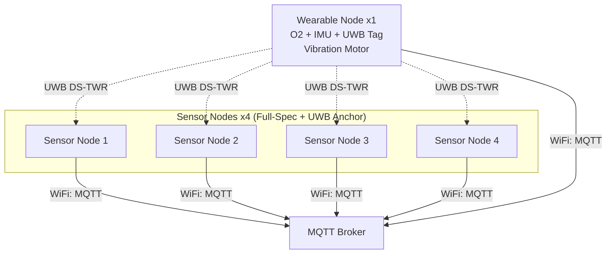
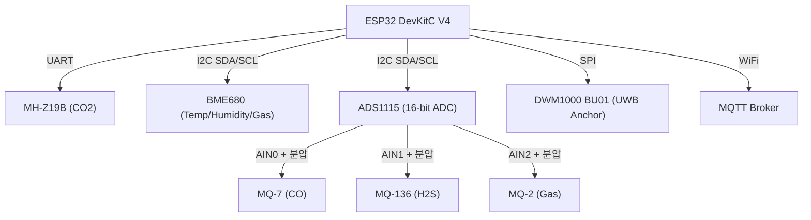
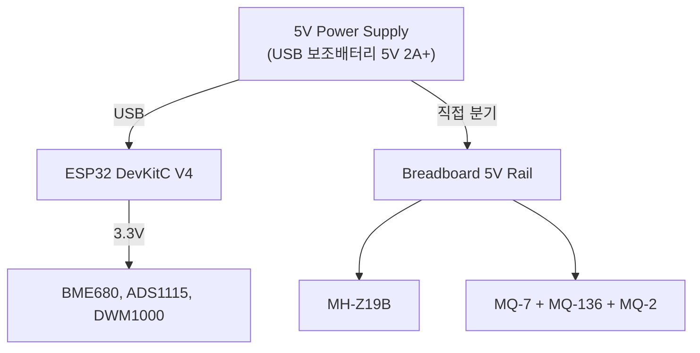
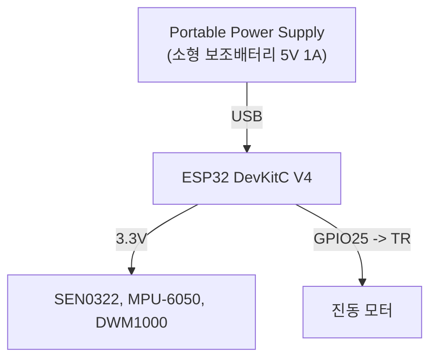
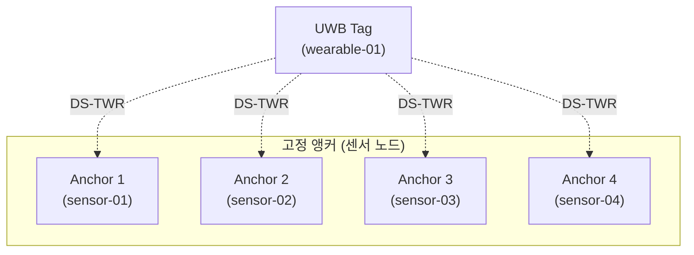
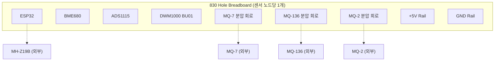

# HARDWARE DESIGN — 하드웨어 설계서

| 항목 | 내용 |
|------|------|
| 문서명 | 하드웨어 설계서 |
| 버전 | v1.0 |
| 상태 | 확정 |
| 최종 수정일 | 2026-07-13 |

> 구매 부품 목록(BOM)은 `docs/BOM.md`를 참조한다.

---

## 1. 하드웨어 시스템 개요

본 시스템은 다음 하드웨어로 구성된다.

- Full-Spec 센서 노드 x 4 (UWB Anchor 역할)
- 웨어러블 노드 x 1 (UWB Tag 역할)
- MQTT Broker / API Server (소프트웨어)

4개의 센서 노드는 동일한 하드웨어 구성으로 제작한다. (ADR-001)



---

## 2. 센서 노드 설계 (x 4, 공통 Full-Spec)

### 2.1 컴포넌트 구성

| 컴포넌트 | 수량/노드 | 역할 | 인터페이스 |
|----------|-----------|------|-----------|
| ESP32 DevKitC V4 | 1 | 메인 MCU | WiFi |
| MH-Z19B | 1 | CO₂ 측정 | UART |
| BME680 | 1 | 온도/습도/기압/가스저항 | I2C |
| MQ-7 | 1 | CO 측정 | Analog -> ADS1115 |
| MQ-136 | 1 | H₂S 측정 | Analog -> ADS1115 |
| MQ-2 | 1 | 가연성 가스 측정 | Analog -> ADS1115 |
| ADS1115 | 1 | 외부 16-bit ADC | I2C |
| DWM1000 BU01 | 1 | UWB Anchor | SPI |

### 2.2 통신 아키텍처



> BME680과 ADS1115는 I2C 버스를 공유한다.
> ADS1115 AIN3 채널은 예비로 유지한다.

---

## 3. MQ 센서 ADC 및 분압 회로 설계

### 3.1 분압 회로 개요

MQ 센서의 아날로그 출력 전압(0~5V)이 ADS1115의 허용 입력 범위를 초과하지 않도록 저항 분압 회로를 적용한다.

### 3.2 설계 값

> 이전 설계(R1=10kΩ, R2=20kΩ -> Vout=3.33V)는 ADS1115의 절대 최대치에 근접하여 여유가 부족하다. TI 사양상 아날로그 입력의 절대 최대치는 VDD + 0.3V이지만, 절대 최대치를 정상 동작 설계값으로 사용해서는 안 된다. 입력 보호 다이오드에 장시간 과전압을 가하지 않도록 설계한다.

**수정된 설계값:**

| 파라미터 | 값 |
|----------|-----|
| R1 (직렬) | 20kΩ |
| R2 (분압) | 10kΩ |
| Vin (최대) | 5V |
| Vout | 5 x 10 / (20 + 10) = **1.67V** |

ADS1115 PGA 게인을 조정하면 1.67V 범위에서도 충분한 분해능을 확보할 수 있다.

### 3.3 분압 회로도

```
MQ Analog Output (0~5V)
    |
    R1 = 20kΩ
    |
    +-----------> ADS1115 Analog Input (AIN0/AIN1/AIN2)
    |
    R2 = 10kΩ
    |
    GND
```

### 3.4 센서 노드당 필요 저항

| 저항 | 수량/노드 | 용도 |
|------|-----------|------|
| 20kΩ | 3 | MQ-7, MQ-136, MQ-2 분압 R1 |
| 10kΩ | 3 | MQ-7, MQ-136, MQ-2 분압 R2 |

### 3.5 노드 전체 필요 저항 (4개)

| 저항 | 수량 |
|------|------|
| 20kΩ | 12 |
| 10kΩ | 12 |

> 조립 전 반드시 멀티미터로 실제 전압을 측정하여 확인한다.

---

## 4. 전원 설계

### 4.1 센서 노드 전원



> MQ 센서 3종 + MH-Z19B 합산 ~600mA로 ESP32 VIN 핀 허용치를 초과한다.
> USB 전원에서 직접 분기하여 브레드보드 5V 레일에 공급한다.
> ESP32와 외부 센서는 반드시 **공통 GND**를 사용한다.

### 4.2 웨어러블 노드 전원



### 4.3 전원 요구사항 (TBD)

> 최종 전원 사양은 전체 센서 동작 상태에서 실제 소비전류를 측정한 후 확정한다.

| 노드 | 입력 전압 | 권장 전원 | 상태 |
|------|-----------|-----------|------|
| 센서 노드 | 5V | 5V 2A 이상 | 측정 후 확정 |
| 웨어러블 노드 | 5V | 5V 1A 소형 | 측정 후 확정 |

---

## 5. 핀 연결 요약

### 5.1 센서 노드 공통 (ESP32 DevKitC V4)

| GPIO | 역할 | 연결 대상 |
|------|------|-----------|
| GPIO16 | UART2 RX | MH-Z19B TX |
| GPIO17 | UART2 TX | MH-Z19B RX |
| GPIO21 | I2C SDA | BME680, ADS1115 (공유) |
| GPIO22 | I2C SCL | BME680, ADS1115 (공유) |
| GPIO18 | SPI SCK | DWM1000 BU01 |
| GPIO19 | SPI MISO | DWM1000 BU01 |
| GPIO23 | SPI MOSI | DWM1000 BU01 |
| GPIO5 | SPI CS | DWM1000 BU01 |
| GPIO26 | IRQ | DWM1000 BU01 |
| GPIO27 | RESET | DWM1000 BU01 |
| VIN (5V) | 전원 | MQ 센서 (USB에서 직접 분기) |
| 3.3V | 전원 | BME680, ADS1115, DWM1000 |

> ADS1115 AIN0 <- MQ-7 (분압 경유), AIN1 <- MQ-136 (분압 경유), AIN2 <- MQ-2 (분압 경유)

### 5.2 웨어러블 노드 (ESP32 DevKitC V4)

| GPIO | 역할 | 연결 대상 |
|------|------|-----------|
| GPIO21 | I2C SDA | MPU-6050, SEN0322 (공유) |
| GPIO22 | I2C SCL | MPU-6050, SEN0322 (공유) |
| GPIO25 | 디지털 출력 | 진동 모터 (트랜지스터 경유) |
| GPIO18 | SPI SCK | DWM1000 BU01 |
| GPIO19 | SPI MISO | DWM1000 BU01 |
| GPIO23 | SPI MOSI | DWM1000 BU01 |
| GPIO5 | SPI CS | DWM1000 BU01 |
| GPIO26 | IRQ | DWM1000 BU01 |
| GPIO27 | RESET | DWM1000 BU01 |

> MLX90640 I2C 400kHz 필요 시: `Wire.begin(21, 22, 400000)` — 단, MVP에서는 MLX90640 제외.

---

## 6. UWB 아키텍처

### 6.1 구성



### 6.2 측위 파이프라인

```
Tag <-> Anchor 1 거리 측정 (DS-TWR)
Tag <-> Anchor 2 거리 측정 (DS-TWR)
Tag <-> Anchor 3 거리 측정 (DS-TWR)
Tag <-> Anchor 4 거리 측정 (DS-TWR)
    |
    v
이상치 제거
    |
    v
2D Least Squares 위치 계산
    |
    v
EMA 필터 (-> Kalman Filter 순차 적용)
    |
    v
2D 위치 (x, y) 출력
```

> TDoA는 MVP에서 제외한다. DS-TWR만 사용한다. (ADR-002)

---

## 7. 진동 모터 회로

### 7.1 회로도

```
ESP32 GPIO25
    |
    1kΩ (베이스 저항)
    |
    B --- S8050 NPN 트랜지스터
    C --------- +5V 레일 (또는 3.3V)
    E --------- 진동 모터 (+) 단자
                진동 모터 (-) 단자 --------- GND

1N4007 다이오드: 모터 양단에 역병렬 (역기전력 보호)
```

### 7.2 주의사항

- 트랜지스터(S8050) + 1kΩ 베이스 저항 + 1N4007 다이오드 회로 필수
- 진동 모터를 GPIO에 직결하지 않는다 (전류 초과 위험)

---

## 8. 브레드보드 프로토타입

개발 및 테스트 단계에서는 830홀 브레드보드를 사용한다. 센서 노드 1개당 브레드보드 1개를 사용한다.



> 크기가 큰 센서(MQ 시리즈, MH-Z19B)는 브레드보드 외부에 배치하고 점퍼선으로 연결한다.

---

## 9. MLX90640 열화상 카메라 (MVP 제외)

### 9.1 상태

| 항목 | 내용 |
|------|------|
| 센서 | MLX90640ESF-BAB |
| MVP 포함 여부 | **제외** (MVP Phase 1) |
| 사유 | ESP32 DevKitC V4 5개가 센서 노드 4개 + 웨어러블 1개에 모두 사용 중 |

### 9.2 향후 계획

1. ESP32 1개 추가 확보 (OQ-3)
2. 고정형 독립 열화상 노드로 구성
3. 웨어러블에 탑재하지 않음 (측정 목적 불명확)
4. 용도: "작업자 존재 및 비정상 정지 상태 보조 탐지" (피부 온도 측정 아님)

---

## 10. 하드웨어 제약사항

- ESP32의 GPIO Logic Level은 **3.3V**이다
- DWM1000은 3.3V 기반으로 동작한다
- MQ 센서의 아날로그 출력(0~5V)은 분압 회로 경유 후 ADS1115에 입력한다 (Vout <= 1.67V)
- MQ 센서는 히터를 사용하므로 충분한 전류 공급이 필요하다 (~600mA/노드)
- 모든 센서는 **공통 GND**를 사용한다
- I2C 장치의 주소 충돌이 없어야 한다
- UWB Anchor는 서로 다른 고정 위치에 설치한다
- 웨어러블 노드는 작업자 활동을 방해하지 않는 크기와 무게여야 한다
- `GPIO6 ~ GPIO11`은 사용 금지 (내부 플래시 전용)
- MQ 센서 DOUT 핀 5V 출력을 ESP32 GPIO에 직결 금지
- MH-Z19B TX -> ESP32 RX, RX -> TX 교차 연결
- MQ 센서 전원 인가 후 **최소 30초 예열** 후 측정
- DWM1000 BU01 납땜 전 핀맵 데이터시트 반드시 확인

---

## 11. 센서 교정 절차

> 상세한 센서 신뢰성 제한은 `08_SAFETY_AND_LIMITATIONS.md`를 참조한다.

### 11.1 MQ 센서 (MQ-7, MQ-136, MQ-2)

1. 예열: 전원 인가 후 30초 이상 대기 (안정화에는 수 시간 권장)
2. R0 측정: 깨끗한 공기 환경에서 Rs 측정 -> R0로 저장
3. 온습도 보정: BME680 데이터를 활용하여 Rs 보정
4. 대상 가스 교정: 알려진 농도 환경에서 Rs/R0 vs 농도 커브 작성
5. 교정 전에는 `calibration_status: "uncalibrated"`, `estimated_ppm: null`

### 11.2 MH-Z19B (CO₂)

- 자동 교정 기능 (ABC, Automatic Baseline Correction) 내장
- 최초 설치 시 야외 공기(~400ppm) 환경에서 24시간 자동 교정 권장

### 11.3 BME680

- BSEC 라이브러리 자동 보정 기능 사용
- 최소 24시간 안정화 필요
- `iaq_accuracy`가 2 이상일 때 IAQ 값 유효

### 11.4 SEN0322 (O₂)

- 출고 시 교정됨
- 주기적 확인 권장 (공기 중 20.9% 확인)
