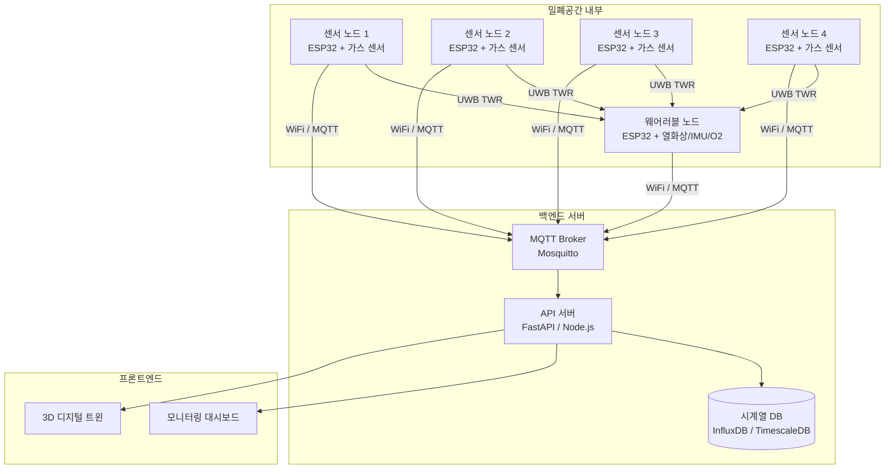

# ARCHITECTURE — 시스템 아키텍처

| 항목 | 내용 |
|------|------|
| 문서명 | 시스템 아키텍처 설계서 |
| 최종 수정일 | 2026-07-05 |
| 버전 | v0.1 |

---

## 전체 시스템 구성도



---

## 컴포넌트 역할

### 센서 노드 × 4 (앵커)

| 항목 | 내용 |
|------|------|
| MCU | ESP32 DevKitC V4 |
| 측정 데이터 | CO2 (MH-Z19B), CO (MQ-7), H2S (MQ-136), VOC/LEL% (MQ-2), 온도/습도/VOC (BME680) |
| ADC | ADS1115 — MQ 센서 아날로그값 16비트 변환 |
| UWB 역할 | **앵커** — 웨어러블 태그와 거리 측정 (TWR) |
| 통신 | WiFi → MQTT publish |
| 발행 주기 | 가스: 5초, 환경: 10초 |

### 웨어러블 노드 × 1 (태그)

| 항목 | 내용 |
|------|------|
| MCU | ESP32 DevKitC V4 |
| 측정 데이터 | 피부 온도 (MLX90640), 산소농도 (SEN0322), 가속도/자이로 (MPU-6050) |
| 낙상 감지 | 합성 가속도벡터 ≥ 2.5g + 1초 이상 정적 상태 |
| UWB 역할 | **태그** — 앵커 4개와 거리 측정 → 위치 계산 |
| 알림 | 위험 감지 시 진동 모터 구동 |
| 통신 | WiFi → MQTT publish |

### MQTT Broker

| 항목 | 내용 |
|------|------|
| 소프트웨어 | Mosquitto (예정) |
| 배포 위치 | 로컬 서버 or 클라우드 VPS (OQ-4 미결정) |
| 역할 | 노드 → 서버 메시지 중계, QoS 1 보장 |

### API 서버

| 항목 | 내용 |
|------|------|
| 역할 | MQTT 수신 → DB 저장, 대시보드에 REST/WebSocket 제공 |
| 알람 처리 | 임계값 초과 감지 → 알림 발행 |

### 시계열 DB

| 항목 | 내용 |
|------|------|
| 후보 | InfluxDB / TimescaleDB (OQ-6 미결정) |
| 저장 단위 | 센서값 타임스탬프 + node_id 태그 |

### 대시보드 / 3D 디지털 트윈

| 항목 | 내용 |
|------|------|
| 대시보드 | 실시간 가스 농도 그래프, 임계값 경보 현황 |
| 3D 트윈 | 조선소 밀폐공간 3D 모델 + 노드 위치 + 가스 농도 히트맵 |
| 기술 스택 | 미결정 (OQ-5: Three.js / Unity WebGL 검토 중) |

---

## 데이터 흐름

```
센서 노드
  └─ MQ-7/136/2 → ADS1115(I2C) → ESP32
  └─ MH-Z19B(UART) → ESP32
  └─ BME680(I2C) → ESP32
  └─ DWM1000 BU01(SPI) → ESP32 [앵커]
       ↓ WiFi
    MQTT Broker
       ↓
    API 서버 ──→ 시계열 DB
       ↓
    대시보드 / 3D 트윈

웨어러블 노드
  └─ MLX90640(I2C) → ESP32
  └─ SEN0322(I2C) → ESP32
  └─ MPU-6050(I2C) → ESP32
  └─ DWM1000 BU01(SPI) → ESP32 [태그]
       ↓ WiFi
    MQTT Broker (위치 + 상태 publish)
```

---

## MQTT 토픽 구조

| 토픽 | 발행 주체 | 내용 |
|------|---------|------|
| `sensors/{node_id}/gas` | 센서 노드 | CO2, CO, H2S, VOC 농도 |
| `sensors/{node_id}/env` | 센서 노드 | 온도, 습도 |
| `sensors/{node_id}/status` | 센서 노드 | 연결 상태, 배터리 |
| `wearable/{node_id}/location` | 웨어러블 | UWB 계산 위치 (x, y, z) |
| `wearable/{node_id}/imu` | 웨어러블 | 가속도, 낙상 감지 여부 |
| `wearable/{node_id}/vital` | 웨어러블 | 피부 온도, 산소 농도 |
| `alerts/{node_id}` | API 서버 | 임계값 초과 경보 |

---

## 기술 스택 요약

| 계층 | 기술 |
|------|------|
| 펌웨어 | Arduino Framework (ESP32), PlatformIO |
| 통신 프로토콜 | MQTT (WiFi), UWB TWR (DWM1000) |
| 브로커 | Mosquitto |
| 백엔드 | 미결정 (FastAPI / Node.js 검토) |
| DB | 미결정 (InfluxDB / TimescaleDB — OQ-6) |
| 프론트엔드 | 미결정 (Three.js / Unity WebGL — OQ-5) |

---

## 미결정 사항 (Open Questions)

| ID | 내용 | 영향 범위 |
|----|------|---------|
| OQ-4 | MQTT 브로커 배포 위치 (로컬 vs 클라우드) | 네트워크 설계 |
| OQ-5 | 3D 트윈 렌더링 기술 (Three.js vs Unity WebGL) | 프론트엔드 전체 |
| OQ-6 | 시계열 DB 선택 (InfluxDB vs TimescaleDB) | 백엔드 스키마 |
