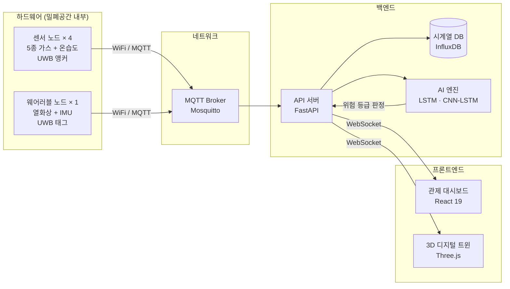
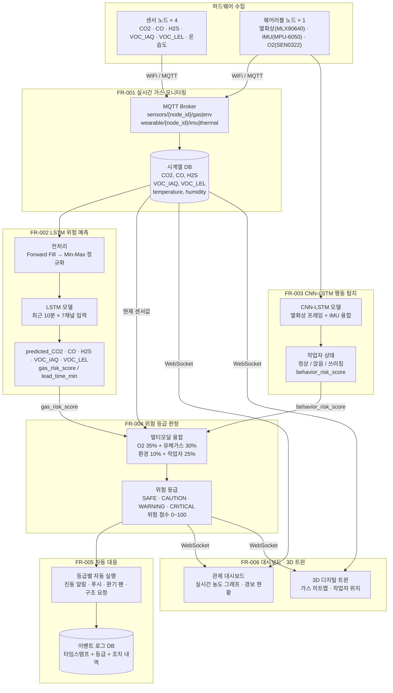
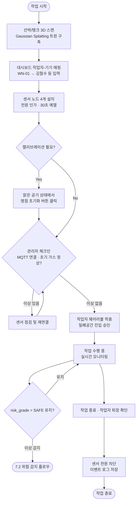
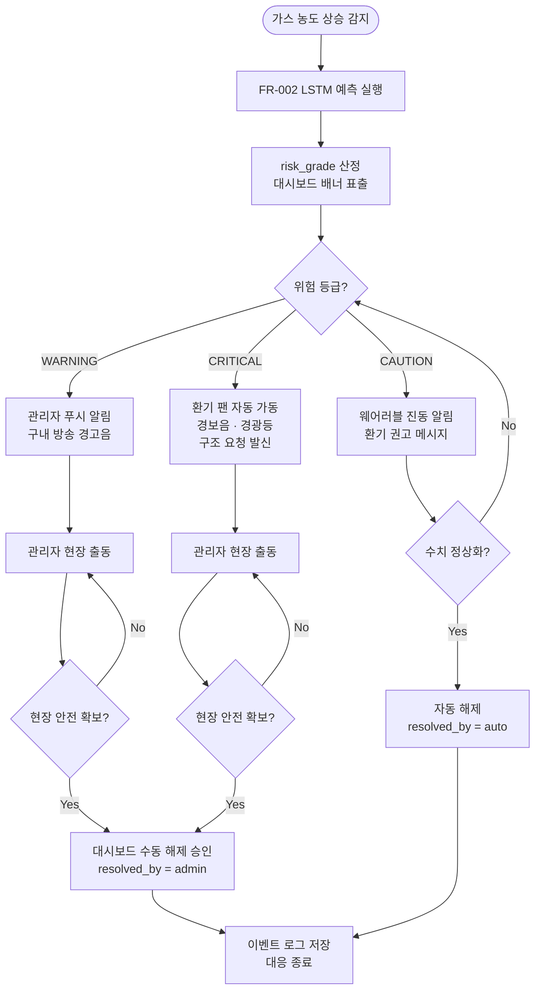
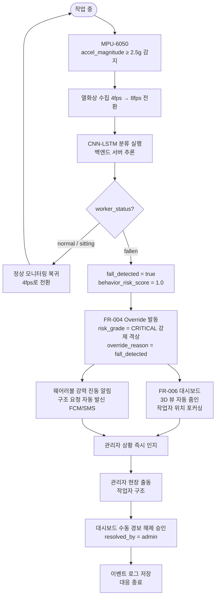
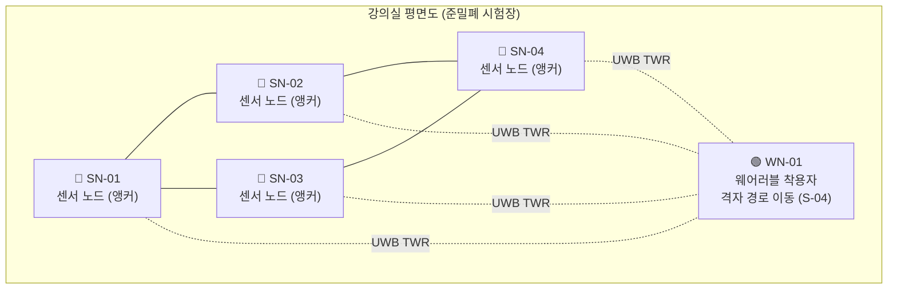

# PRD — 제품 요구사항 정의서

| 항목 | 내용 |
|------|------|
| 문서명 | IoT 센서 시계열 분석 및 3D 디지털 트윈 기반 조선소 밀폐공간 모니터링 시스템 PRD |
| 프로젝트명 | IoT센서 시계열 분석 및 3D 디지털 트윈 기반 조선소 밀폐공간 모니터링 시스템 |
| 버전 | v2.0 |
| 작성일 | 2026-07-05 |
| 최종 수정일 | 2026-07-10 |
| 하위 문서 | [TEST_PLAN.md](TEST_PLAN.md) — 시뮬레이션 검증 상세 절차 / [ARCHITECTURE.md](../26_HP015/docs/ARCHITECTURE.md) — 시스템 아키텍처 / [HARDWARE.md](../26_HP015/docs/HARDWARE.md) — 하드웨어 부품 목록 |
| 작성자 | 최환석 |
| 멘토 | 최영선 |
| 팀원 | 류정민, 여서정, 김무준 |
| 수행기간 | 2026.06.01 ~ 2026.10.31 |

---

## 0. 문서 사용 규칙

### 0.1 요구사항 강도

| 표현 | 의미 |
|------|------|
| MUST | MVP 구현에 필수. 미구현 시 MVP 성공 기준을 충족하지 못한다. |
| SHOULD | MVP에 포함하는 것을 원칙으로 하되, 일정상 조정 가능하다. |
| MAY | 선택 구현 또는 향후 확장이다. |
| OUT OF SCOPE | MVP에서 제외한다. |

### 0.2 문서 간 우선순위

1. 본 PRD.md
2. 하드웨어 회로 구상 초안
3. 수행계획서·개요서
4. 기타 회의록

### 0.3 면책 범위

본 시스템은 작업자 안전을 보조하는 모니터링·경보 도구이다. 최종 대피 판단 및 작업 중지 결정은 현장 관리자에게 있으며, 본 시스템의 경보가 공식 안전 기준을 대체하지 않는다.

---

## 1. 개요

본 프로젝트는 조선소 밀폐공간 질식사고 예방을 위한 'AI 기반 3D 디지털 트윈 관제 시스템' 구축을 목표로 함.  IoT 센서(고정식+웨어러블)로 수집한 데이터를 AI로 분석해 위험을 선제 예측하고, 3D 대시보드를 통해 직관적인 관제와 단계별 자동 대응 지원.

---

## 2. 배경 및 문제 정의

### 2.1 배경

고용노동부 통계(2015~2024) 기준 최근 10년간 밀폐공간 질식재해자 298명 중 126명(42.3%)이 사망하였으며, 전체 사망사고의 86%는 작업 중 가스 농도 미측정에서 비롯되었다. 특히 조선소 도장 공정은 유기용제 기화로 인한 급격한 산소 결핍과 VOC, H₂S, CO 등 다중 유해가스의 동시 축적이 발생하여 질식 위험이 상시 도사리는 고위험 환경이다.

국제해사기구(IMO)는 SOLAS 협약(제11-1장 규칙 7) 및 밀폐공간 진입 권고안(A.1050(27) / MSC.581(110))을 통해 작업 중 지속적 모니터링과 위험 평가 시스템 도입을 강력히 권고하고 있다. 국내에서는 중대재해처벌법 발효로 사망사고 발생 시 경영책임자에게 징역 또는 10억 원 이하의 벌금이 부과되며, 대형 조선소 기준 작업중지 명령 시 하루 수십억 원의 생산 손실이 발생한다.

### 2.2 기존 시스템의 한계

- **사후 감지 방식**: 작업 전 1회 측정 후 작업 중 지속 감시 없음. 가스 농도가 기준치를 초과한 직후에야 경보가 울려 작업자가 골든타임을 확보하지 못함
- **단순 임계값 알람**: 기준치 초과 후 반응하는 구조로 선제 대응 불가. 오경보율 30~40%로 알람 피로(Alarm Fatigue) 유발
- **공간 통합 관제 불가**: 작업자 위치·행동·상태·가스 분포를 통합적으로 판단하는 수단 부재
- **고정식 센서 설치 한계**: 비계 설치가 불가능한 협소 구역에서 안전 사각지대 발생

### 2.3 실제 사고 사례

- 「선박 탱크 페인트칠하던 외국인 근로자 질식…119 구조」 — 연합뉴스, 2021
- 「10년간(12~21년) 밀폐공간 질식사고로 348명 죽거나 다쳐」 — 고용노동부 보도자료, 2022
- 「영암 선박부품 업체서 하청 노동자 질식사… 아르곤 가스 작업 중 사고」 — 매일경제, 2026

---

## 3. 목표 및 성공 기준

### 3.1 MVP 목표

- 기준치 도달 **3~5분 전 선제 경보** 발령으로 작업자 안전 대피 골든타임 확보
- 가스 수치 + 작업자 행동 **AND 조건 융합**으로 오경보율 10% 이하 달성
- 3D 공간 관제 및 **위험 등급별 자동 대응** 연동으로 관리자 조치 지연 최소화
- 지연 없는 데이터 파이프라인 및 통신 단절 시 로컬 버퍼링 동작 검증

### 3.2 성공 기준

| 지표 | 목표값 | 측정 기준 및 비고 |
|------|--------|----------------|
| 선제 경보 리드타임 | 기준치 도달 3~5분 전 | 시뮬레이션 환경 내 점진적 가스 축적 시나리오 기준 |
| AI 모델 미탐지율 (False Negative) | 1% 미만 | 실제 위험 상황을 정상으로 오판하는 비율 (생명 직결 지표) |
| 오경보율 (False Positive) | 10% 이하 | 가스 수치 + 행동 탐지 AND 조건 융합으로 달성 |
| 위험 등급 판정 지연 | 수집 후 3초 이내 | 엣지 디바이스 수집부터 대시보드 경보 표출까지의 총 지연시간 |
| UWB 위치 추적 오차 | ±30cm 이하 | 금속 구조물이 포함된 장애물 환경 시뮬레이션 기준 |
| 통신 단절 시 데이터 복구율 | 99% 이상 | Wi-Fi 단절 후 재연결 시, 로컬 버퍼링된 시계열 데이터 누락 방어율 |
| 웨어러블 노드 동작 시간 | 8시간 이상 무중단 | 1교대 작업 시간 기준 (가스 수집 및 MQTT 전송 최대 부하 상태) |

---

## 4. 타겟 사용자

| 사용자 유형 | 역할 및 특징 | 페인 포인트 (Pain Point) | 시스템을 통한 주요 목표 (기대 가치) |
|-----------|-----------|----------------------|--------------------------------|
| **현장 작업자** | 밀폐공간 내 도장·전처리 작업 수행, 웨어러블 기기 착용 | • 언제 유해가스가 찰지 몰라 늘 불안함<br>• 알람이 울리면 이미 숨이 막혀 늦음<br>• 무겁고 거추장스러운 안전장비 기피 | 위험 수치 도달 전 선제 알림(진동)을 받아 **안전하게 대피할 골든타임 확보** |
| **안전 관리자** | 외부에서 관제 대시보드 모니터링 및 비상 상황 총괄 대응 | • 보이지 않는 탱크 내부 상황 파악 불가<br>• 잦은 가스 센서 오경보로 인한 피로감<br>• 사고 발생 시 구체적인 위치 파악 지연 | 3D 공간 관제로 사각지대 없이 현장을 파악하고, **정확한 위험 판정으로 즉각적 조치(환기/구조) 지시** |
| **시스템 관리자** | 센서 노드 및 네트워크 설치·유지보수 관리 | • 열악한 도장 환경에 의한 센서 잦은 고장<br>• 철제 구조물로 인한 통신 단절 잦음 | 직관적인 기기 상태(배터리, 통신) 모니터링으로 **안정적인 데이터 수집 및 시스템 무중단 유지** |
| **안전보건 책임자 (CSO/경영진)** | 현장 안전보건 총괄, 법적 규제 및 규정 준수 여부 검토 | • 사고 발생 시 막대한 법적/경제적 리스크<br>• 현장 안전 감시가 제대로 이뤄지는지 증빙 불가 | 데이터 영구 기록 및 이벤트 로그를 통한 **중대재해 예방 및 안전보건확보의무 이행 입증** |

> **구현 우선순위**
> 본 시스템은 4개 사용자 유형 모두의 요구사항을 반영하여 설계하되, MVP 구현 범위는 **현장 작업자**와 **안전 관리자**를 최우선 대상으로 한다. 사고 예방의 핵심 가치인 선제 경보(작업자)와 실시간 관제(관리자)가 구현되어야 시스템의 존재 이유가 성립하기 때문이다. 시스템 관리자용 기기 상태 모니터링과 안전보건 책임자용 이벤트 로그 기능은 핵심 파이프라인 완성 후 추가한다.

---

## 5. 시스템 구성

### 5.1 하드웨어 구성

| 기기 | 수량 | 역할 및 주요 탑재 센서 |
|------|------|---------------------|
| **센서 노드** (ESP32 DevKitC V4) | 4 | **밀폐공간 고정 감시 및 측위 앵커**<br>• 5종 유해가스 센서 (CO₂, CO, H₂S, VOC·IAQ, VOC·LEL)<br>• 온·습도·VOC 복합 센서 (BME680)<br>• UWB 실내 측위 앵커 (DWM1000) |
| **웨어러블 노드** (ESP32 DevKitC V4) | 1 | **작업자 밀착 감시 및 측위 태그**<br>• 열화상 카메라 (MLX90640) 및 IMU (MPU-6050)<br>• **산소 센서 (SEN0322) — 작업자 호흡역 O₂ 직접 측정**<br>• UWB 실내 측위 태그 (DWM1000)<br>• 햅틱 모터 (위험 시 진동 알림용) |

> 부품 상세 목록, 핀 연결, 구간별 구매 계획은 [HARDWARE.md](../26_HP015/docs/HARDWARE.md) 참조

### 5.2 소프트웨어 구성

| 계층 (Layer) | 컴포넌트 | 기술 스택 |
|------------|---------|---------|
| **디바이스 (Device)** | 센서 데이터 수집 및 MQTT 발행 | Arduino Framework, PlatformIO |
| **네트워크 (Network)** | 메시지 큐 기반 실시간 중계 | Wi-Fi (로컬 AP), Mosquitto (MQTT Broker) |
| **백엔드 (Backend)** | 비동기 API 처리 및 WebSocket 스트리밍 | FastAPI, uvicorn |
| **데이터 (Data)** | 센서 시계열 데이터 및 이벤트 로그 저장 | SQLite (로컬 버퍼링용) / InfluxDB (시계열 메인 DB) |
| **AI (AI/ML)** | 시계열 위험 예측 및 이미지/패턴 기반 행동 탐지 | LSTM (가스 예측), CNN-LSTM (행동 분류) |
| **프론트엔드 (Frontend)** | 실시간 관제 대시보드 UI 및 상태 관리 | React 19, TypeScript 6, Zustand, Recharts |
| **3D 시각화 (3D)** | 선박 탱크 가상화 및 가스·위치 히트맵 매핑 | Gaussian Splatting, Three.js |

> 전체 시스템 데이터 흐름 및 아키텍처는 [ARCHITECTURE.md](../26_HP015/docs/ARCHITECTURE.md) 참조

### 5.3 시스템 아키텍처 개요



> 센서 핀 연결·회로 구성 상세는 [HARDWARE.md](../26_HP015/docs/HARDWARE.md) 참조 /
> 데이터 흐름·MQTT 토픽·컴포넌트 역할 상세는 [ARCHITECTURE.md](../26_HP015/docs/ARCHITECTURE.md) 참조

---

## 6. 핵심 기능

### 기능 요구사항 요약

| ID | 기능명 | 우선순위 | 관련 사용자 |
|----|--------|---------|-----------|
| FR-001 | 실시간 다중 가스 농도 모니터링 | MUST | 현장 작업자, 안전 관리자 |
| FR-002 | LSTM 기반 시계열 위험 예측 | MUST | 안전 관리자 |
| FR-003 | CNN-LSTM 기반 작업자 이상 행동 탐지 | MUST | 안전 관리자 |
| FR-004 | 멀티모달 융합 4단계 위험 등급 판정 | MUST | 안전 관리자 |
| FR-005 | 위험 등급별 자동 대응 | MUST | 현장 작업자, 안전 관리자 |
| FR-006 | 실시간 관제 대시보드 및 3D 디지털 트윈 | MUST | 안전 관리자 |

### 전체 데이터 플로우



---

### [MUST] FR-001 실시간 다중 가스 농도 모니터링

**설명**
밀폐공간 내 6종 IoT 가스 센서를 복수 지점에 고정 설치하여 초 단위로 데이터를 수집하고 MQTT로 실시간 전송한다. 단일 센서 오작동에 대비한 교차 검증 방식을 채택하여 감시 사각지대를 최소화하며, 비계 설치 불가 구역에서는 웨어러블 센서 기반 경량화 모드로 유연하게 전환 운용한다.

**입력**

| 분류 | 센서 | 측정 항목 | 인터페이스 |
|------|------|---------|---------|
| 가스 | MH-Z19B | CO₂ 농도 (ppm) | UART |
| 가스 | MQ-7 | CO 농도 (ppm) | 아날로그 → ADS1115 |
| 가스 | MQ-136 | H₂S 농도 (ppm) | 아날로그 → ADS1115 |
| 가스 | MQ-2 | VOC 폭발하한 (LEL%) | 아날로그 → ADS1115 |
| 환경·VOC | BME680 | 온도 (°C), 습도 (% RH), VOC IAQ 지수 (0~500) | I2C |

> O₂ 센서(SEN0322)는 **웨어러블 노드**에만 탑재. 작업자 호흡역의 산소 농도를 직접 측정하며, FR-003 → FR-004로 전달된다.

**출력**

MQTT 토픽 `sensors/{node_id}/gas` (5초 주기), `sensors/{node_id}/env` (10초 주기) publish

```json
{
  "timestamp": "2026-07-10T09:32:01Z",
  "node_id": "SN-01",
  "CO2": 420,
  "CO": 4.2,
  "H2S": 0.3,
  "VOC_IAQ": 85,
  "VOC_LEL": 3.1,
  "temperature": 28.4,
  "humidity": 65.2
}
```

**DB 저장 스키마**

| 컬럼명 | 타입 | 설명 |
|--------|------|------|
| `timestamp` | TIMESTAMP | 수집 시각 (UTC) |
| `node_id` | VARCHAR | 센서 노드 식별자 (SN-01 ~ SN-04) |
| `CO2` | FLOAT | 이산화탄소 (ppm) |
| `CO` | FLOAT | 일산화탄소 (ppm) |
| `H2S` | FLOAT | 황화수소 (ppm) |
| `VOC_IAQ` | INT | BME680 VOC IAQ 지수 (0~500, Bosch BSEC 산출) |
| `VOC_LEL` | FLOAT | VOC 폭발하한 (LEL%) |
| `temperature` | FLOAT | 온도 (°C) |
| `humidity` | FLOAT | 습도 (% RH) |

**조건 / 제약**

- `[수집 주기 근거]` 가스 센서 샘플링 주기 **5초**는 아래 산업용 고정식 가스 감지기 표준을 준용한 값이다. MQ 계열 센서 T90 응답 시간이 약 30초이므로 1초 단위 샘플링은 실질적 정보 증가 없이 전송량만 늘리며, 5초 주기가 가스 농도 변화 추세 감지에 충분하다.
  - IEC 60079-29-1:2016 *Gas detectors — Performance requirements of detectors for flammable gases*, Clause 5.4 "Response time T90 ≤ 30 s"
  - ISA-92.0.01-2010 *Performance Requirements for Toxic Gas-Detection Instruments*, Section 4.3 "Sample interval ≤ 5 s for fixed monitors"
  - 산업안전보건법 시행규칙 제143조 (고정식 가스 감지기 설치 기준): 경보 설정값 초과 30초 이내 감지 의무 → 5초 주기로 충분히 충족
- `[하드웨어]` MQ 센서 전원 인가 후 최소 30초 예열 필수
- `[내구성]` PTFE 테플론 멤브레인 필터 장착으로 페인트 미스트·분진으로부터 센서 보호
- `[데이터 유실 방지]` WiFi 단절 시 ESP32 로컬 메모리에 임시 저장 후 복구 시 자동 동기화 (단, 메모리 초과 시 오래된 데이터부터 덮어쓰는 FIFO 정책 적용)

---

### [MUST] FR-002 LSTM 기반 시계열 위험 예측

**설명**
수집된 다변량 시계열 센서 데이터를 LSTM 모델로 분석하여 농도 변화 추세 기반 예측형 경보를 구현한다. 기준치 도달 3~5분 전 선제 경보를 발령하는 것이 기존 단순 임계값 알람과의 핵심 차별점이다.

**입력**

FR-001에서 수집된 최근 10분치 센서값 (5초 단위, 120포인트, 7채널) — 아래 전처리 적용 후 모델 입력

> O₂는 웨어러블(SEN0322)에서 수집되어 FR-003을 통해 FR-004로 직접 전달되므로 LSTM 입력 채널에서 제외한다.

| 필드명 | 타입 | 설명 | 전처리 |
|--------|------|------|--------|
| `timestamp` | TIMESTAMP | 수집 시각 (UTC) | — |
| `node_id` | VARCHAR | 센서 노드 식별자 | — |
| `CO2` | FLOAT | 이산화탄소 (ppm) | 결측 시 Forward Fill → Min-Max 정규화 |
| `CO` | FLOAT | 일산화탄소 (ppm) | 결측 시 Forward Fill → Min-Max 정규화 |
| `H2S` | FLOAT | 황화수소 (ppm) | 결측 시 Forward Fill → Min-Max 정규화 |
| `VOC_IAQ` | INT | BME680 VOC IAQ 지수 (0~500) | 결측 시 Forward Fill → Min-Max 정규화 |
| `VOC_LEL` | FLOAT | VOC 폭발하한 (LEL%) | 결측 시 Forward Fill → Min-Max 정규화 |
| `temperature` | FLOAT | 온도 (°C) | 결측 시 Forward Fill → Min-Max 정규화 |
| `humidity` | FLOAT | 습도 (% RH) | 결측 시 Forward Fill → Min-Max 정규화 |

**출력**

| 필드명 | 타입 | 설명 |
|--------|------|------|
| `predicted_CO2` | FLOAT | N분 후 예측 CO2 농도 (ppm) |
| `predicted_CO` | FLOAT | N분 후 예측 CO 농도 (ppm) |
| `predicted_H2S` | FLOAT | N분 후 예측 H2S 농도 (ppm) |
| `predicted_VOC_IAQ` | INT | N분 후 예측 VOC IAQ 지수 (0~500) |
| `predicted_VOC_LEL` | FLOAT | N분 후 예측 VOC LEL (%) |
| `gas_risk_score` | FLOAT | 유해가스 위험도 점수 (0~1) |
| `lead_time_min` | FLOAT | 기준치 도달까지 예측 잔여 시간 (분) |

```json
{
  "timestamp": "2026-07-10T09:32:01Z",
  "node_id": "SN-01",
  "predicted_CO2": 4800,
  "predicted_CO": 28.5,
  "predicted_H2S": 9.1,
  "predicted_VOC_IAQ": 320,
  "predicted_VOC_LEL": 44.5,
  "gas_risk_score": 0.83,
  "lead_time_min": 3.5
}
```

> 출력 `gas_risk_score` → **FR-004** 멀티모달 융합 판정의 '유해가스 위험도 (30%)' 가중치 입력으로 전달

**LSTM 데이터 윈도우 파이프라인**

백엔드 API 서버는 `sensors/{node_id}/gas` 토픽을 컨슈밍하여 각 노드별로 과거 10분(120포인트) 시계열 시퀀스 벡터를 메모리 내 슬라이딩 윈도우 큐에 유지한다. 이를 LSTM 신경망 인풋으로 입력하여 5분 뒤의 가스 농도 예측값(Ŷ_{t+5min})을 선제 추론한다.

**조건 / 제약**

- `[학습 데이터]` UCI Gas Sensor Array Drift Dataset, SKAB 공개 데이터셋 + 밀폐 모형 시뮬레이션 자체 수집 데이터
- `[라벨링 기준]` 산업안전보건법 기준치를 위험 라벨로 자동 적용 (CO > 30ppm, H₂S > 10ppm, CO₂ > 5,000ppm, VOC LEL > 50%) → 수작업 라벨링 없이 학습 데이터 구성 (O₂는 FR-003 경로로 분리되어 LSTM 라벨링 범위 제외)
- `[급변 감지]` 절대 농도 기준 이내라도 H₂S 5ppm 이상 상승 시 예방적 경고 발령
- `[추론 속도]` 전체 시스템 위험 등급 판정 3초 이내 목표 달성을 위해 LSTM 추론 시간 1초 이내로 제한. 필요 시 모델 경량화 (레이어 축소, 양자화) 적용

---

### [MUST] FR-003 CNN-LSTM 기반 작업자 이상 행동 탐지

**설명**
웨어러블에 탑재된 MLX90640 열화상 센서(32×24) 연속 프레임을 백엔드 서버의 CNN-LSTM 모델에 입력하여 작업자 행동 상태를 분류한다. CNN이 단일 프레임의 공간적 자세 특징을 추출하고, 후단 LSTM이 시계열 동작 패턴을 학습하여 MPU-6050 IMU 데이터와 융합함으로써 낙상 감지 정확도를 향상시킨다. ESP32는 연산 없이 데이터 수집·전송만 담당하며, 모든 추론은 백엔드 서버에서 처리한다.

**입력**

| 필드명 | 타입 | 설명 | 샘플링 |
|--------|------|------|--------|
| `timestamp` | TIMESTAMP | 수집 시각 (UTC) | — |
| `wearable_id` | VARCHAR | 웨어러블 노드 식별자 | — |
| `thermal_frame` | FLOAT[32×24] | MLX90640 열화상 프레임 (픽셀별 온도, °C) | 상시 4fps / 충격 감지 시 8fps |
| `accel_x` | FLOAT | MPU-6050 X축 가속도 (g) | 50Hz |
| `accel_y` | FLOAT | MPU-6050 Y축 가속도 (g) | 50Hz |
| `accel_z` | FLOAT | MPU-6050 Z축 가속도 (g) | 50Hz |
| `gyro_x` | FLOAT | MPU-6050 X축 자이로 (°/s) | 50Hz |
| `gyro_y` | FLOAT | MPU-6050 Y축 자이로 (°/s) | 50Hz |
| `gyro_z` | FLOAT | MPU-6050 Z축 자이로 (°/s) | 50Hz |
| `accel_magnitude` | FLOAT | 합성 가속도벡터 √(x²+y²+z²) (g) | 50Hz (서버 산출) |
| `O2` | FLOAT | SEN0322 산소 농도 (% vol) | 5초 |

**출력**

| 필드명 | 타입 | 설명 |
|--------|------|------|
| `O2` | FLOAT | 현재 산소 농도 (% vol) — FR-004 산소 위험도 판정 입력으로 직접 전달 |
| `worker_status` | ENUM | 작업자 상태 분류: `normal` / `sitting` / `fallen` |
| `behavior_risk_score` | FLOAT | 작업자 상태 위험도 점수 (0~1) |
| `fall_detected` | BOOLEAN | 낙상 여부 (true 시 FR-004 CRITICAL 직결 트리거) |
| `confidence` | FLOAT | 분류 신뢰도 (0~1) |

```json
{
  "timestamp": "2026-07-10T09:32:01Z",
  "wearable_id": "WN-01",
  "O2": 19.5,
  "worker_status": "fallen",
  "behavior_risk_score": 1.0,
  "fall_detected": true,
  "confidence": 0.97
}
```

> 출력 `behavior_risk_score` → **FR-004** 멀티모달 융합 판정의 '작업자 상태 위험도 (25%)' 가중치 입력으로 전달
> `fall_detected = true` 시 가중치 계산 없이 **즉시 CRITICAL 등급으로 직결**

**조건 / 제약**

- `[추론 환경]` ESP32는 연산 불가. CNN-LSTM 추론은 백엔드 서버에서 처리. 웨어러블은 MQTT를 통해 원시 데이터만 전송
- `[대역폭 최적화]` 평상시 열화상 4fps 전송 유지. MPU-6050 합성 가속도 ≥ 2.5g 충격 감지 시 8fps로 전환하여 정밀 낙상 판정 수행 (하이브리드 트리거 로직)
- `[추론 속도]` 충격 감지 후 낙상 판정까지 1초 이내 완료 목표
- `[학습 데이터]` UR-Fall, UP-Fall, Roboflow 공개 낙상 탐지 데이터셋으로 파인튜닝
- `[내구성]` 도장 환경의 페인트 미스트·분진·저조도 조건에서도 체온 기반으로 안정적 탐지 가능

---

### [MUST] FR-004 멀티모달 융합 4단계 위험 등급 판정

**설명**
FR-002(LSTM 가스 예측)와 FR-003(CNN-LSTM 행동 탐지) 출력을 가중 합산하여 0~100점 복합 위험 점수를 산정하고 4단계 위험 등급을 즉시 출력한다. 단순 가중치 합산만으로는 커버되지 않는 치명적 상황(낙상 확정, 산소 급락 등)을 위한 CRITICAL 강제 격상(Override) 로직을 안전망으로 추가하여 구조 지연을 원천 차단한다.

**가중치 구성**

| 항목 | 입력 출처 | 가중치 |
|------|---------|--------|
| 산소 위험도 | FR-003 `O2` 현재값 (SEN0322, 웨어러블) | 35% |
| 유해가스 위험도 | FR-002 `gas_risk_score` | 30% |
| 환경 위험도 | FR-001 `temperature`, `humidity` | 10% |
| 작업자 상태 위험도 | FR-003 `behavior_risk_score` | 25% |

**복합 위험 점수 산정 알고리즘**

단순한 이진형 임계값 초과 판정이 아닌, 다중 요소 가중 점수 결합 알고리즘을 수행한다.

```
Total Risk Score = (S_O₂ × 0.35) + (S_Gas × 0.30) + (S_Env × 0.10) + (S_Worker × 0.25)
```

| 항목 | 설명 |
|------|------|
| S_O₂ | 산소 농도 감점 점수 — 정상 범위 20.9% 기준 이탈 시 감점 적용 |
| S_Gas | 유해가스 복합 지수 — CO, H₂S, VOC 정규화 가중합 |
| S_Env | BME680 기반 온·습도 불쾌/열지수 점수 |
| S_Worker | MPU-6050 및 열화상 기반 이상 징후 매핑 점수 |

**위험 등급 기준**

> ⚠️ 아래 컷오프는 MVP 초기값이며, 시뮬레이션 검증(Section 11) 결과를 반영하여 재설정한다.

| 등급 | 점수 | 의미 |
|------|------|------|
| SAFE | 0~24점 | 정상 작업 |
| CAUTION | 25~49점 | 환기 상태 확인 |
| WARNING | 50~74점 | 작업 중단 준비 |
| CRITICAL | 75~100점 | 즉시 대피 및 구조팀 투입 |

**입력**

| 필드명 | 타입 | 출처 |
|--------|------|------|
| `O2` | FLOAT | FR-003 현재 산소 농도 (SEN0322, 웨어러블) |
| `gas_risk_score` | FLOAT | FR-002 유해가스 위험도 (0~1) |
| `behavior_risk_score` | FLOAT | FR-003 작업자 상태 위험도 (0~1) |
| `fall_detected` | BOOLEAN | FR-003 낙상 여부 |
| `temperature` | FLOAT | FR-001 현재 온도 |
| `humidity` | FLOAT | FR-001 현재 습도 |

**출력**

| 필드명 | 타입 | 설명 |
|--------|------|------|
| `risk_grade` | ENUM | 위험 등급: `SAFE` / `CAUTION` / `WARNING` / `CRITICAL` |
| `risk_score` | INT | 복합 위험 점수 (0~100) |
| `override_triggered` | BOOLEAN | CRITICAL 강제 격상 발동 여부 |
| `override_reason` | VARCHAR | 격상 사유 (예: `fall_detected`, `O2_critical`) |

```json
{
  "timestamp": "2026-07-10T09:32:01Z",
  "node_id": "SN-01",
  "risk_grade": "CRITICAL",
  "risk_score": 100,
  "override_triggered": true,
  "override_reason": "fall_detected"
}
```

> 출력 `risk_grade`, `risk_score` → **FR-005** 자동 대응 트리거 입력 / **FR-006** 대시보드·3D 트윈 WebSocket 브로드캐스트
> 출력 `risk_grade` → `alerts/{node_id}` MQTT 토픽 publish → 웨어러블 진동 알림 및 현장 경보 기기로 즉시 전달

**조건 / 제약**

- `[Override 로직]` 가중치 합산 점수와 무관하게 아래 조건 중 하나라도 충족 시 즉시 CRITICAL 강제 격상
  - `fall_detected = true` (FR-003 낙상 확정)
  - `O2 < 18%` (산소 결핍 기준치 미달)
  - `H2S > 10ppm` 또는 `CO > 30ppm` 단독 임계값 초과
- `[가산점 상한]` 5분 이내 급변 감지 시 15점 가산. 단, 최종 `risk_score` 는 Max 100 초과 불가
- `[오경보율]` 가중치 융합 AND 조건으로 오경보율 10% 이하 목표

---

### [MUST] FR-005 위험 등급별 자동 대응

**설명**
FR-004에서 산정된 위험 등급에 따라 차등화된 자동 대응을 즉시 실행한다. CAUTION은 수치 정상화 시 자동 해제되나, WARNING·CRITICAL은 수치가 정상화되어도 **관리자의 수동 승인 전까지 경보를 유지**한다. 이는 가스 농도가 낮아진 것처럼 보여도 이미 쓰러진 작업자가 있을 수 있기 때문이다. 모든 실행 이력은 이벤트 로그 DB에 영구 저장된다.

**등급별 대응 및 제어 방식**

| 등급 | 자동 대응 | 제어 방식 | 해제 방식 |
|------|---------|---------|---------|
| CAUTION | 웨어러블 진동 알림 + 환기 권고 메시지 | MQTT `alerts/` publish → 웨어러블 수신 | 수치 정상화 시 자동 해제 |
| WARNING | 관리자 푸시 알림 + 구내 방송 경고음 | FCM / SMS API 호출 | **관리자 수동 승인 필요** |
| CRITICAL | 환기 팬 자동 가동 + 경보음·경광등 + 구조 요청 발신 | IoT 릴레이 제어 + FCM / SMS API 호출 | **관리자 수동 승인 필요** |

**입력**

| 필드명 | 타입 | 출처 |
|--------|------|------|
| `risk_grade` | ENUM | FR-004 위험 등급 (`SAFE` / `CAUTION` / `WARNING` / `CRITICAL`) |
| `risk_score` | INT | FR-004 복합 위험 점수 (0~100) |
| `override_triggered` | BOOLEAN | FR-004 CRITICAL 강제 격상 여부 |
| `override_reason` | VARCHAR | FR-004 강제 격상 사유 |
| `node_id` | VARCHAR | 경보 발생 노드 식별자 |
| `timestamp` | TIMESTAMP | 위험 등급 판정 시각 |

**출력**

| 필드명 | 타입 | 설명 |
|--------|------|------|
| `action_type` | VARCHAR | 실행 대응 유형 (`vibration` / `push` / `ventilation` / `rescue`) |
| `action_grade` | ENUM | 대응 시점 위험 등급 |
| `action_timestamp` | TIMESTAMP | 대응 실행 시각 |
| `control_success` | BOOLEAN | 릴레이·알림 제어 성공 여부 |
| `control_error` | VARCHAR | 제어 실패 시 오류 내용 (정상 시 `null`) |
| `resolved` | BOOLEAN | 대응 해제 여부 |
| `resolved_by` | VARCHAR | 해제 주체 (`auto` / `admin:{user_id}`) |
| `resolved_timestamp` | TIMESTAMP | 대응 해제 시각 |

```json
{
  "action_type": "ventilation",
  "action_grade": "CRITICAL",
  "action_timestamp": "2026-07-10T09:32:04Z",
  "node_id": "SN-01",
  "control_success": true,
  "control_error": null,
  "resolved": false,
  "resolved_by": null,
  "resolved_timestamp": null
}
```

**이벤트 로그 DB 스키마**

| 컬럼명 | 타입 | 설명 |
|--------|------|------|
| `log_id` | INT (PK) | 이벤트 고유 ID |
| `node_id` | VARCHAR | 경보 발생 노드 |
| `risk_grade` | ENUM | 위험 등급 |
| `risk_score` | INT | 복합 위험 점수 |
| `action_type` | VARCHAR | 실행 대응 유형 |
| `override_triggered` | BOOLEAN | 강제 격상 여부 |
| `override_reason` | VARCHAR | 강제 격상 사유 |
| `action_timestamp` | TIMESTAMP | 대응 실행 시각 |
| `control_success` | BOOLEAN | 제어 성공 여부 |
| `control_error` | VARCHAR | 제어 실패 내용 |
| `resolved` | BOOLEAN | 해제 여부 |
| `resolved_by` | VARCHAR | 해제 주체 |
| `resolved_timestamp` | TIMESTAMP | 해제 시각 |

**조건 / 제약**

- `[해제 로직]` CAUTION은 수치 정상화 시 자동 해제 (`resolved_by = "auto"`). WARNING·CRITICAL은 수치 정상화와 무관하게 관리자 수동 승인 필수 (`resolved_by = "admin:{user_id}"`)
- `[제어 실패 예외 처리]` IoT 릴레이 또는 FCM/SMS 제어 실패 시 `control_success = false`, `control_error` 기록 후 대시보드에 "제어 실패" 경고 즉시 표출. 관리자가 수동 조치하도록 유도
- `[영구 보존]` 이벤트 로그는 삭제 불가. 중대재해처벌법 대응 법적 증빙 자료로 활용
- `[중복 방지]` 동일 `node_id`에 동일 등급 대응이 이미 활성화된 경우 중복 실행 차단

---

### [MUST] FR-006 실시간 관제 대시보드 및 3D 디지털 트윈

**설명**
React 기반 실시간 관제 대시보드와 Gaussian Splatting + Three.js 기반 3D 디지털 트윈으로 밀폐공간 위험 상황을 직관적으로 시각화한다. 대시보드에는 공간별 가스 농도 실시간 그래프, 위험 등급, 작업자 위치·상태 히트맵, 경보 이력 로그, 조치 가이드가 표시된다. CRITICAL 경보 발생 시 3D 카메라 뷰가 해당 위험 구역으로 자동 줌인되어 관리자가 즉시 상황을 파악할 수 있다.

**입력**

| 필드명 | 타입 | 출처 |
|--------|------|------|
| `risk_grade` | ENUM | FR-004 위험 등급 |
| `risk_score` | INT | FR-004 복합 위험 점수 |
| `node_id` | VARCHAR | 경보 발생 노드 식별자 |
| `CO2`, `CO`, `H2S`, `VOC_IAQ`, `VOC_LEL` | FLOAT/INT | FR-001 실시간 가스 농도 |
| `O2` | FLOAT | FR-003 실시간 산소 농도 (SEN0322, 웨어러블) |
| `temperature`, `humidity` | FLOAT | FR-001 실시간 환경값 |
| `worker_status` | ENUM | FR-003 작업자 상태 |
| `fall_detected` | BOOLEAN | FR-003 낙상 여부 |
| `wearable_x`, `wearable_y`, `wearable_z` | FLOAT | UWB 위치 좌표 (m) |
| `action_type` | VARCHAR | FR-005 실행 대응 유형 |
| `ws_status` | ENUM | WebSocket 연결 상태 (`connected` / `reconnecting` / `disconnected`) |

**출력**

| 화면 구성 요소 | 표시 데이터 | 설명 |
|--------------|-----------|------|
| 실시간 가스 농도 그래프 | `O2`(FR-003), `CO2`, `CO`, `H2S`, `VOC_IAQ`, `VOC_LEL`, `timestamp`, `node_id` | 노드별 가스 시계열 차트 (Recharts). 위험 임계값 기준선 표시 |
| 위험 등급 배너 | `risk_grade`, `risk_score`, `node_id`, `override_reason` | 상단 전체 화면 등급 표시 (SAFE: 초록 / CAUTION: 노랑 / WARNING: 주황 / CRITICAL: 빨강). Override 발동 시 사유 함께 표시 |
| 작업자 위치 표시 | `wearable_x`, `wearable_y`, `wearable_z`, `worker_status`, `fall_detected` | UWB 좌표 기반 3D 공간 내 작업자 위치 마커. 쓰러짐 시 마커 색상 빨강 + 깜빡임 |
| 가스 분포 히트맵 | `CO2`, `H2S`, `VOC_IAQ`, `node_id`, `wearable_x/y/z` | 노드 간 보간 농도를 3D 공간에 색상으로 시각화. 농도 높을수록 빨강 계열 |
| 센서 노드 상태 패널 | `node_id`, `ws_status`, `temperature`, `humidity`, `action_type` | 노드별 연결 상태, 온습도, 현재 대응 실행 여부 카드 형태 표시 |
| 경보 이력 로그 | `action_timestamp`, `risk_grade`, `action_type`, `override_reason`, `resolved`, `resolved_by` | 이벤트 발생 순서대로 목록 표시. 미해제 경보는 상단 고정 |
| 3D 자동 줌인 | `risk_grade`, `fall_detected`, `node_id`, `wearable_x/y/z` | CRITICAL 또는 낙상 감지 시 해당 위치로 카메라 자동 포커싱 |
| 통신 상태 배너 | `ws_status` | `reconnecting` / `disconnected` 시 "데이터 수신 지연 (통신 불안정)" 배너 표출 |

**조건 / 제약**

- `[3D 렌더링 성능]` Three.js 3D 트윈 렌더링 30 FPS 이상 유지 목표. 클라이언트 GPU 성능 부족 또는 브라우저 과부하 감지 시 자동으로 2D 평면 맵(Fallback) 모드로 전환
- `[자동 줌인 UX]` `risk_grade = CRITICAL` 또는 `fall_detected = true` 수신 시 해당 `node_id` 위치로 3D 카메라 즉시 자동 줌인. 관리자가 수동으로 뷰를 이동하기 전까지 포커스 유지
- `[WebSocket 재연결]` 연결 끊김 감지 시 자동 재연결 (Exponential Backoff, 최대 5회). 재연결 시도 중 화면에 "데이터 수신 지연 (통신 불안정)" 배너 표출하여 관리자 오판 방지
- `[연결 복구 후 동기화]` WebSocket 재연결 성공 시 단절 구간 데이터를 REST API로 즉시 보완 요청하여 차트 공백 방지
- `[작업자-기기 매핑]` 작업 시작 전 관리자가 대시보드 설정 화면에서 `wearable_id`(WN-01 등)에 작업자 이름을 텍스트로 직접 입력하여 매핑. 경보 발생 시 `wearable_id` 대신 매핑된 작업자 이름으로 표시 (예: "WN-01 → 김철수"). HR DB 연동은 MVP 범위 외(OUT OF SCOPE)
- `[기술 스택]` React 19 + TypeScript 6 + Zustand Store, Recharts, Three.js, Gaussian Splatting
- `[공간 보간 — 가스 히트맵]` 4개의 고정식 센서 노드가 제공하는 가스 데이터 값(V₁, V₂, V₃, V₄)을 사용하여 3차원 공간 전체의 유해가스 음영 구역을 도출하기 위해 **역거리 가중치 보간법(IDW)** 소프트웨어 필터를 적용한다.

  임의의 공간 좌표 P(x, y, z)에서의 가스 추정 농도 W(P)는 각 센서 노드와의 거리 dᵢ의 역평방 가중치를 사용하여 실시간 계산된다.

  ```
  W(P) = Σᵢ₌₁⁴ (1/dᵢᵖ · Vᵢ) / Σᵢ₌₁⁴ (1/dᵢᵖ)

  Vᵢ : 센서 노드 i 의 측정 농도
  dᵢ : P 에서 센서 노드 i 까지의 유클리드 거리
  p  : 거리 감쇠 지수 (기본값 p = 2)
  ```

  계산된 그리드 매트릭스를 기반으로 프론트엔드 WebGL 뷰어 스페이스 상에 투명도가 조절된 3D 가스 밀집도 히트맵을 알파 채널 텍스처 파티클로 실시간 렌더링한다.

---

## 7. 사용자 플로우

### 7.1 정상 작업 플로우



1. 작업 전 선박/탱크 내부 3D 스캔 → Gaussian Splatting 기반 디지털 트윈 구축
2. **[작업자-기기 매핑]** 관리자가 대시보드 설정에서 `wearable_id` → 작업자 이름 텍스트 입력 (예: WN-01 → 김철수)
3. 센서 노드 4개 비계 설치 및 전원 인가 (30초 예열 대기)
4. **[캘리브레이션]** MQ 센서 영점 틀어짐 의심 시 맑은 공기 상태에서 대시보드 영점 초기화 버튼 클릭 → 정상 시 생략 가능
5. **[체크인]** 관리자가 대시보드에서 전체 센서 노드 Wi-Fi·MQTT 연결 상태(`ws_status = connected`) 및 초기 가스 농도 정상 여부 확인
6. 이상 없음 확인 후 작업자 웨어러블 착용 및 밀폐공간 진입 승인
7. 작업 중 실시간 가스 농도·작업자 위치·상태 모니터링 (`risk_grade = SAFE` 유지 확인)
8. 작업 종료 후 작업자 퇴장 확인 → 센서 전원 차단 → 이벤트 로그 저장

### 7.2 위험 감지 플로우



1. FR-001 가스 농도 상승 감지 → FR-002 LSTM 모델 예측 실행
2. 기준치 도달 3~5분 전 `risk_grade` 상향 산정 및 대시보드 배너 즉시 표출
3. **CAUTION**: 웨어러블 진동 알림 + 환기 권고 메시지 전송 → 수치 정상화 시 자동 해제
4. **WARNING**: 관리자 스마트폰 푸시 알림 + 구내 방송 경고음 → **관리자 수동 승인 전까지 경보 유지**
5. **CRITICAL**: 환기 팬 즉시 자동 가동 + 경보음·경광등 + 구조 요청 자동 발신 → **관리자 수동 승인 전까지 경보 유지**
6. 관리자 현장 출동 및 상황 확인
7. 현장 안전 확보 후 대시보드에서 직접 경보 해제 승인 (`resolved_by = "admin:{user_id}"`) → 대응 종료 및 이벤트 로그 기록

### 7.3 낙상 감지 플로우



1. FR-003 MPU-6050 합성 가속도벡터 ≥ 2.5g 충격 감지 → 열화상 프레임 수집 8fps로 전환
2. MLX90640 연속 프레임 CNN-LSTM 분류 → `worker_status = fallen`, `fall_detected = true` 판정
3. FR-004 Override 로직 발동 → 가중치 점수 합산 무관하게 `risk_grade = CRITICAL` 즉시 강제 격상 (`override_reason = "fall_detected"`)
4. FR-006 대시보드 3D 트윈 카메라가 해당 작업자 위치(`wearable_x/y/z`)로 **자동 줌인** → 관리자 즉시 상황 인지
5. 웨어러블 강력 진동 알림 + 구조 요청 자동 발신 (FCM/SMS)
6. 관리자 현장 출동 → 작업자 구조 후 대시보드에서 수동 경보 해제 승인 → 이벤트 로그 기록

---

## 8. 비기능 요구사항

### 8.1 성능

| 항목 | 목표값 | 비고 |
|------|--------|------|
| 센서 데이터 수집 주기 | 가스 5초, 환경 10초 | FR-001 |
| 위험 등급 판정 지연 | 수집 후 3초 이내 | 가스 수집 5초 + 처리 3초 = 최대 8초 총 경보 지연 (가스 농도 변화 시점 기준) |
| LSTM 추론 시간 | 1초 이내 | 전체 3초 목표 내 AI 파트 할당 |
| 대시보드 실시간 갱신 | 1초 이내 | WebSocket 기준 |
| LSTM 예측 리드타임 | 기준치 도달 3~5분 전 | FR-002 |
| 동시 노드 처리 용량 | 센서/웨어러블 노드 50개 이상 | 백엔드 MQTT 수신·DB 저장 동시 처리 기준. MVP 최소 타겟 |

### 8.2 신뢰성

- `[연속 동작]` 8시간 이상 무중단 동작 (1교대 작업 시간 기준)
- `[WiFi 단절 복구]` ESP32 로컬 버퍼 저장 후 복구 시 자동 동기화. 메모리 초과 시 FIFO 정책 적용
- `[센서 교차 검증]` 단일 센서 오작동 시 나머지 센서 데이터로 위험 판정 유지
- `[AI 서버 장애 Fallback]` 백엔드 LSTM/CNN-LSTM 추론 서버 장애 감지 시, AI 예측 없이 **즉각 센서 원시값 기반 Rule-based 경보 시스템으로 자동 전환**. 산업안전보건법 법적 임계값(O₂ < 18%, CO > 30ppm 등) 직접 비교로 위험 등급 판정. 대시보드에 "AI 추론 불가 — 임계값 기반 경보 모드 동작 중" 배너 표출

### 8.3 확장성

- MQTT 토픽 구조 기반으로 센서 노드 추가 시 설정 변경만으로 확장 가능
- 웨어러블 단독 경량화 모드 지원 (비계 설치 불가 구역 대응)

### 8.4 보안

| 항목 | MVP 기준 | 비고 |
|------|---------|------|
| 대시보드 관리자 인증 | ID/PW 로그인 필수 | 미인증 접근 시 경보 해제·설정 변경 불가 |
| API 통신 암호화 | HTTPS + WSS (TLS 1.2 이상) | HTTP·WS 평문 통신 금지 |
| MQTT 통신 보안 | TLS 암호화 + ID/PW Basic Auth | OQ-004 최종 결정 전 임시 타겟 |
| 이벤트 로그 위변조 방지 | DB 직접 삭제·수정 API 미제공 | 중대재해처벌법 법적 증빙 자료 보호 |
| 센서 데이터 저장 | 로컬 DB 저장 필수 | 클라우드 의존 없이 증빙 보존 |

### 8.5 유지보수성

- `[OTA 펌웨어 업데이트]` 밀폐공간 내 비계에 고정 설치된 센서 노드는 USB 직접 연결 없이 WiFi를 통한 **OTA(Over-The-Air) 무선 펌웨어 업데이트**로 배포 및 패치를 수행한다. ESP32-IDF의 `esp_https_ota` API 또는 Arduino OTA 라이브러리를 활용하며, 업데이트 실패 시 이전 펌웨어로 자동 롤백한다.
  - MVP 범위: OTA 기능 설계 및 동작 검증 (실제 배포 파이프라인 자동화는 상용화 단계로 미룸)

### 8.6 사용성

- `[Zero-touch 웨어러블]` 도장 작업자는 방진복·장갑 착용으로 소형 버튼 조작이 불가능하다. 웨어러블 기기는 **전원 인가만으로 자동 초기화·MQTT 연결·모니터링 시작**이 완료되어야 하며, 작업 중 물리적 UI 조작이 전혀 필요 없는 Zero-touch 운용을 원칙으로 한다.
- `[고대비 UI]` 현장 관제 모니터는 직사광선·분진 환경에 노출될 수 있다. 대시보드는 **High Contrast 테마**(배경 #000000, 위험 등급별 채도 높은 강조색)를 지원하여 저조도·고조도 환경에서도 위험 등급을 즉시 식별할 수 있어야 한다.

### 8.7 규제 준수 및 MVP 면책 범위

> **[방폭 인증 한계 명시]**
>
> 본 MVP 프로토타입에 사용된 ESP32 DevKitC V4 및 MQ 계열 센서 모듈은 **방폭(Explosion-Proof) 인증을 받지 않은 일반 상용 보드**이다. 페인트 유증기·가연성 가스가 체류하는 실제 조선소 밀폐공간에 반입되는 전자기기는 아래 인증 중 하나 이상이 요구된다.
>
> | 인증 | 기준 | 적용 지역 |
> |------|------|---------|
> | ATEX (Zone 1/2) | EU Directive 2014/34/EU | 유럽 |
> | IECEx | IEC 60079 시리즈 | 국제 |
> | KCs 방폭 | 산업안전보건법 제84조 | 대한민국 |
>
> **상용화 전 필수 조치**: 방폭 하우징(Ex d — 내압 방폭) 또는 본질안전(Ex ia) 회로 설계로 재설계 후 인증 취득. 본 MVP는 학술·연구 목적의 프로토타입으로, 실제 밀폐공간 내 통전 운용을 전제로 하지 않는다.

> **참고 링크**
> - [EU Directive 2014/34/EU (ATEX)](https://eur-lex.europa.eu/legal-content/EN/TXT/?uri=CELEX%3A32014L0034) — 유럽 방폭 기기 지침 전문
> - [IECEx 인증 제도](https://www.iecex.com/about-iecex/iecex-system/) — 국제 방폭 인증 개요
> - [IEC 60079 시리즈 목록](https://www.iec.ch/dyn/www/f?p=103:38:0::::FSP_ORG_ID:1297) — 폭발성 분위기 장비 표준군
> - [산업안전보건법 제84조 (안전인증)](https://www.law.go.kr/법령/산업안전보건법/(20240101,19611,20231010)/제84조) — KCs 방폭 인증 법적 근거

---

## 9. 데이터 요구사항

### 9.1 측정 항목

개별 센서의 측정 항목·데이터 타입·단위 등 상세 명세는 **[14. 데이터 딕셔너리]** 를 따르며, 구체적인 샘플링 주기는 각 기능 요구사항의 입력 기준을 따른다.

| 데이터 종류 | 샘플링 주기 기준 |
|------------|--------------|
| 가스 농도 (CO₂, CO, H₂S, VOC) | FR-001 입력 조건 (5초) |
| 산소 농도 (O₂) | FR-003 입력 조건 (5초, 웨어러블 SEN0322) |
| 환경 (온도, 습도) | FR-001 입력 조건 (10초) |
| 작업자 위치 (UWB) | FR-003 입력 조건 |
| 작업자 상태 (열화상 + IMU) | FR-003 입력 조건 (상시 4 fps / 충격 감지 시 8 fps) |

### 9.2 위험 임계값 (산업안전보건법 기준)

| 항목 | 정상 | 주의 | 경고 | 위험 | 기준 |
|------|------|------|------|------|------|
| O₂ | ≥ 20% | 19~20% | 18~19% | < 18% | 산업안전보건법 시행규칙 제143조 |
| CO₂ | < 1,000 ppm | 1,000~2,000 ppm | 2,000~5,000 ppm | ≥ 5,000 ppm | ACGIH TLV-TWA |
| CO | < 25 ppm | 25~30 ppm | 30 ppm 초과 | ≥ 30 ppm | 산업안전보건법 시행규칙 제143조 |
| H₂S | < 1 ppm | 1~5 ppm | 5~10 ppm | ≥ 10 ppm | 산업안전보건법 시행규칙 제143조 |
| VOC_IAQ (BME680 IAQ 지수) | < 50 | 50~100 | 100~200 | ≥ 200 | Bosch BSEC 등급 (1~50 우수 / 51~100 양호 / 101~200 나쁨 / 201+ 매우 나쁨) — 법적 단일 기준 없음 |
| VOC_LEL (폭발하한) | < 10% | 10~25% | 25~50% | ≥ 50% | IEC 60079-29-1 / KOSHA |

> 급변 감지: O₂ 1% 이상 하락 / H₂S 5ppm 이상 상승 시 예방적 경고 발령
>
> VOC_IAQ는 BME680의 가스 저항값을 Bosch BSEC 라이브러리로 처리한 복합 IAQ 지수이다. 페인트 유증기 노출 간접 지표로 활용하며, 특정 유기용제(톨루엔·자일렌 등)의 법적 개별 기준은 MSDS를 별도 참조한다.

### 9.3 MQTT 토픽 구조

| 토픽 | 발행 주체 | 내용 |
|------|---------|------|
| `sensors/{node_id}/gas` | 센서 노드 | CO₂, CO, H₂S, VOC_IAQ, VOC_LEL |
| `sensors/{node_id}/env` | 센서 노드 | 온도, 습도 |
| `sensors/{node_id}/status` | 센서 노드 | 연결 상태, 배터리 |
| `wearable/{node_id}/location` | 웨어러블 | UWB 위치 (x, y, z) |
| `wearable/{node_id}/imu` | 웨어러블 | accel_x/y/z, gyro_x/y/z, accel_magnitude, fall_detected |
| `wearable/{node_id}/thermal` | 웨어러블 | MLX90640 열화상 32×24 프레임 배열 (float[768]) |
| `alerts/{node_id}` | API 서버 | 위험 등급 + 복합 위험 점수 |

### 9.4 데이터 보존

**Hot / Cold 스토리지 수명 주기**

| 데이터 종류 | Hot (시계열 DB, 즉시 조회) | Cold (로컬 아카이브) |
|------------|--------------------------|-------------------|
| 센서 시계열 | 최근 30일 보관 — 대시보드 실시간 조회 | 30일 경과 후 CSV 압축 → 로컬 스토리지 아카이빙 (AI 재학습용) |
| 이벤트·경보 로그 | 전 기간 Hot 유지 | 영구 보존 (중대재해처벌법 법적 증빙) |
| AI 학습 데이터 | — | UCI Gas Sensor Array Drift Dataset, SKAB + 시뮬레이션 자체 수집 데이터 병행 보관 |

---

## 10. 제약 조건

### 10.1 예산

- 1구간 확정 예산: 805,360원 (부품 발주 완료)
- 2구간(전원부), 3구간(회로 소모품): 수량 산정 후 발주 예정
- 자세한 내용은 [HARDWARE.md](../26_HP015/docs/HARDWARE.md) 참조

### 10.2 하드웨어

→ 핀 제약(GPIO6~11, ADC2), 전류 공급, 필터 장착 요건은 **[MUST] FR-001 조건/제약** 참조

### 10.3 네트워크

→ WiFi 단절 복구(로컬 버퍼·FIFO), MQTT QoS 1, AI Fallback 정책은 **8.2 신뢰성** 참조

### 10.4 법적 기준

| 법령 / 협약 | 적용 내용 |
|------------|---------|
| 산업안전보건법 시행규칙 제143조 | 밀폐공간 가스 농도 임계값 기준 (O₂, CO, H₂S 등) |
| 중대재해처벌법 제4조 | 안전 관리 이행 의무 — 이벤트 로그 위변조 방지, 경보 이력 보존 |
| IMO SOLAS 제11-1장 규칙 7 | 선박 밀폐공간 진입 전 가스 측정 의무 |
| IMO MSC.1/Circ.1430 (A.1050(27) 개정) | 밀폐공간 진입 권고안 — 연속 모니터링 권장 |
| IEC 60079-29-1:2016 | 고정식 가스 감지기 T90 응답 기준 (≤ 30s) → 5초 수집 주기 근거 |

> **참고 링크**
> - [산업안전보건법 시행규칙 (국가법령정보센터)](https://www.law.go.kr/법령/산업안전보건법시행규칙) — 제143조 밀폐공간 가스 감지기 설치 기준
> - [중대재해처벌법 (국가법령정보센터)](https://www.law.go.kr/법령/중대재해처벌등에관한법률) — 제4조 사업주 안전 관리 의무
> - [IMO SOLAS 협약 통합본](https://www.imo.org/en/KnowledgeCentre/ConventionsAndProtocols/Pages/SOLAS.aspx) — 제11-1장 규칙 7 (선박 구조 안전)
> - [IMO MSC.1/Circ.1430](https://www.imo.org/en/OurWork/Safety/Pages/DangerousGoods.aspx) — 밀폐공간 진입 권고안 (A.1050(27) 개정)
> - [IEC 60079-29-1:2016 (IEC Webstore)](https://webstore.iec.ch/publication/24308) — 고정식 가스 감지기 성능 요건

---

## 11. 시뮬레이션 검증 계획

### 11.1 환경 구성

강의실(창문·문 밀폐) 전체를 준밀폐 시험장으로 활용한다. 실제 조선소 탱크와 동일한 기밀 구조는 아니지만, 창문을 닫으면 CO₂가 자연 축적되고 에탄올 증기에 BME680이 반응하는 준밀폐 환경을 구성할 수 있다. 센서 노드 4개를 강의실 사방 모서리에 고정 배치하고, 웨어러블 1개를 실험 참여자가 착용한다.



| 구성 요소 | 내용 |
|---------|------|
| 장소 | 강의실 1개 (창문·문 밀폐) |
| 센서 노드 | 4개 — 강의실 모서리 고정 (앵커 역할 겸용) |
| 웨어러블 | 1개 — 실험 참여자 착용 |
| CO₂ 발생원 | 실험 참여자 호흡 + CO₂ 카트리지 소량 보조 주입 |
| VOC 발생원 | 소독용 에탄올 소량 개방 (BME680 IAQ 응답 확인용) |
| CO · H₂S | MQTT 소프트웨어 주입으로 대체 (안전상 실물 주입 불가) |

**검증 범위 한계**

- 본 실험은 **학술·공모전 수준 프로토타입 검증**이며, 실제 조선소 밀폐공간의 기밀성·가스 농도 분포와 동일하지 않다.
- CO · H₂S 소프트웨어 주입 결과는 **경보 파이프라인 정합성 검증**이며, 실제 센서 응답 검증과 구분하여 보고한다.
- BME680 IAQ 수치는 VOC ppm과 직접 대응되지 않으므로 S-02는 **센서 응답 및 경보 파이프라인 검증**으로 한정하여 해석한다.
- **3D 디지털 트윈은 강의실 Gaussian Splatting 스캔을 기반으로 구축한다.** 강의실은 실제 조선소 탱크와 공간 구조가 다르지만, 본 시스템의 3D 트윈은 스캔 데이터만 교체하면 어떤 공간에도 적용 가능한 구조로 설계된다. MVP 단계에서 강의실을 사용하는 것은 실험 환경과의 일치를 위한 선택이며, 실제 현장 배포 시에는 해당 밀폐공간을 스캔한 데이터로 대체한다.

### 11.2 검증 시나리오

**S-01. CO₂ 점진적 축적 — LSTM 프로토타입 예측 검증**
- 참여자 호흡 + CO₂ 카트리지로 400ppm → 1,500ppm 완만 상승 유도
- CO₂를 산소 결핍 대체 프록시로 활용: 실제 조선소에서 CO₂ 상승은 산소 소모와 병행하며, 밀폐공간 내 CO₂ 농도 증가 추세는 O₂ 결핍 진행을 간접 반영한다 (NIOSH Pocket Guide 참조)
- LSTM이 CAUTION 임계값(CO₂ 1,000ppm) 도달 3~5분 전 예측 경보를 발령하는지 확인
- **해석 주의**: 본 실험은 LSTM 모델의 트렌드 예측 동작 여부를 확인하는 **프로토타입 기능 검증**이며, 통계적 모델 성능 평가(정밀도·재현율)와 구분한다. 충분한 성능 검증은 공개 데이터셋(UCI, SKAB) 기반 오프라인 평가로 별도 수행한다.

**S-02. VOC 자극 — 센서 응답 및 경보 파이프라인 검증**
- 에탄올 소량 개방 → BME680 IAQ 지수 급등 유도 (목표: IAQ 100 이상 응답 확인)
- 센서 수집 → 대시보드 경보 표출까지 총 지연 측정
- **해석 주의**: IAQ 수치는 실제 VOC ppm과 직접 대응되지 않는다. 본 시나리오의 목적은 "VOC 농도 측정 정확도"가 아닌 **BME680 응답 → MQTT → 경보 표출 파이프라인의 지연 검증**에 한정한다.

**S-03. CO · H₂S 임계값 초과 — CRITICAL Override 파이프라인 검증 (소프트웨어 주입)**
- MQTT 브로커에 `CO: 35ppm`, `H2S: 12ppm` 직접 발행 (실물 가스 주입 없음)
- FR-004 Override 로직 발동 → 가중치 점수 무관 CRITICAL 즉시 격상 확인
- 검증 범위: 센서 응답이 아닌 **수신 데이터 → 판정 로직 → 경보 전달 파이프라인 정합성**

**S-04. UWB 위치 추적 정확도**
- 앵커 4개 강의실 모서리 고정, 작업자가 격자 경로(1m 간격) 이동
- 20개 지점에서 실제 위치 vs 대시보드 표시 위치 비교, 오차 분포 측정
- **목표값**: ±30cm 이하 (도전 목표 — NLOS·인체 차폐 환경에서 달성 어려울 수 있으며, 미달 시 앵커 배치 최적화 또는 목표값 ±50cm로 재조정)

**S-05. 낙상 감지 정확도**
- 웨어러블 착용 후 매트 위 의도적 낙상 **30회** + 일상 동작(빠른 걸음·앉기·허리 숙임·점프) 각 **10회(총 40회)**
- fall_detected 정오 여부 기록, 혼동 행렬(TP/FP/TN/FN) 작성
- **표본 수 한계 명시**: 30회 낙상은 통계적 신뢰도가 높지 않으며, 결과는 "프로토타입 동작 확인" 수준으로 해석한다. 엄밀한 성능 평가는 공개 낙상 데이터셋(UR-Fall, UP-Fall) 오프라인 평가로 보완한다.

**S-06. AI Fallback 전환 검증**
- 백엔드 AI 추론 서버 강제 종료 → Rule-based 경보 자동 전환 및 배너 표출 확인
- Fallback 상태에서 CO₂ 임계값 초과 시 경보 정상 발령 여부 추가 확인

**S-07. WiFi 단절 복구 — 데이터 유실 방지**
- ESP32 WiFi 강제 차단 30초 → 재연결 후 로컬 버퍼 데이터 자동 동기화 확인
- 검증 지표: 단절 구간 데이터 전량 DB 반영, FIFO 정책 작동 확인

### 11.3 검증 목표

| 시나리오 | 항목 | 목표값 | 검증 유형 |
|---------|------|--------|---------|
| S-01 | LSTM 선제 경보 리드타임 | 기준치 도달 3~5분 전 | 프로토타입 기능 검증 |
| S-02, S-03 | 경보 표출 총 지연 | 수집 후 3초 이내 | 파이프라인 정합성 검증 |
| S-04 | UWB 위치 오차 | ±30cm 이하 (도전 목표) | 하드웨어 성능 검증 |
| S-05 | 낙상 감지율 | 80% 이상 | 프로토타입 기능 검증 |
| S-05 | 오경보율 | 20% 이하 | 프로토타입 기능 검증 |
| S-06 | Fallback 전환 | 자동 전환 및 배너 표출 | 신뢰성 검증 |
| S-07 | 데이터 복구 | 단절 구간 전량 동기화 | 신뢰성 검증 |

> 상세 검증 절차(안전 관리 기준, 실험 순서, 데이터 기록 변수, Pass/Fail 판정 기준)는 [TEST_PLAN.md](TEST_PLAN.md) 참조

---

## 12. 마일스톤

| 시점 | 추진 내용 | 완료 기준 | 상태 |
|------|---------|---------|------|
| 2026.06 | 프로젝트 기획·설계, 부품 발주, 공개 데이터셋 확보 | PRD·아키텍처 설계 문서 완성, 부품 수령 | ✅ 완료 |
| 2026.07 | HW 조립, 센서 드라이버 구현, MQTT 파이프라인 구축 | 센서 노드 → MQTT → 서버 데이터 수신 검증 | 🔄 진행 중 |
| 2026.08 | AI 모델 학습·검증, 백엔드 API 서버 구축, 대시보드 기본 화면 | LSTM 추론 동작 확인, 대시보드 실시간 수신 표시 | — |
| 2026.09 | UWB 위치 추적 연동, CNN-LSTM 낙상 감지 통합, 3D 트윈 초안 | UWB 오차 ±50cm 이하, 낙상 감지 동작 확인 | — |
| 2026.10 | 전체 시스템 통합, 강의실 시뮬레이션 검증, 최종 결과물 | TEST_PLAN 시나리오 S-01~S-07 통과, 논문 초안 완성 | — |

## 13. 데이터 딕셔너리

FR-001~006 전체에서 사용되는 변수의 단일 정의 기준표. 변수명 변경 시 이 표를 먼저 수정하고 각 FR에 반영한다.

### 13.1 센서 수집 데이터 (FR-001 정의)

| 필드명 | 타입 | 단위 | 정의 | 정의 출처 | 사용처 |
|--------|------|------|------|---------|--------|
| `timestamp` | TIMESTAMP | — | 데이터 수집 시각 (UTC) | FR-001 | FR-002, FR-003, FR-004, FR-005 |
| `node_id` | VARCHAR | — | 센서 노드 식별자 (SN-01 ~ SN-04) | FR-001 | FR-004, FR-005, FR-006 |
| `CO2` | FLOAT | ppm | 이산화탄소 농도 | FR-001 | FR-002, FR-006 |
| `CO` | FLOAT | ppm | 일산화탄소 농도 | FR-001 | FR-002, FR-004, FR-006 |
| `H2S` | FLOAT | ppm | 황화수소 농도 | FR-001 | FR-002, FR-004, FR-006 |
| `VOC_IAQ` | INT | 0~500 | BME680 VOC IAQ 지수 (Bosch BSEC 산출) | FR-001 | FR-002, FR-006 |
| `VOC_LEL` | FLOAT | LEL% | VOC 폭발하한 비율 | FR-001 | FR-002, FR-006 |
| `temperature` | FLOAT | °C | 온도 | FR-001 | FR-004, FR-006 |
| `humidity` | FLOAT | % RH | 습도 | FR-001 | FR-004, FR-006 |

### 13.2 LSTM 예측 데이터 (FR-002 정의)

| 필드명 | 타입 | 단위 | 정의 | 정의 출처 | 사용처 |
|--------|------|------|------|---------|--------|
| `predicted_CO2` | FLOAT | ppm | N분 후 예측 CO2 농도 | FR-002 | FR-006 |
| `predicted_CO` | FLOAT | ppm | N분 후 예측 CO 농도 | FR-002 | FR-006 |
| `predicted_H2S` | FLOAT | ppm | N분 후 예측 H2S 농도 | FR-002 | FR-006 |
| `predicted_VOC_IAQ` | INT | 0~500 | N분 후 예측 VOC IAQ 지수 | FR-002 | FR-006 |
| `predicted_VOC_LEL` | FLOAT | LEL% | N분 후 예측 VOC LEL | FR-002 | FR-006 |
| `gas_risk_score` | FLOAT | 0~1 | LSTM 산출 유해가스 위험도 점수 | FR-002 | FR-004 |
| `lead_time_min` | FLOAT | 분 | 기준치 도달까지 예측 잔여 시간 | FR-002 | FR-004, FR-006 |

### 13.3 웨어러블 수집 및 행동 탐지 데이터 (FR-003 정의)

| 필드명 | 타입 | 단위 | 정의 | 정의 출처 | 사용처 |
|--------|------|------|------|---------|--------|
| `wearable_id` | VARCHAR | — | 웨어러블 노드 식별자 (WN-01) | FR-003 | FR-004, FR-005, FR-006 |
| `O2` | FLOAT | % vol | SEN0322 산소 농도 (작업자 호흡역 직접 측정) | FR-003 | FR-004, FR-006 |
| `thermal_frame` | FLOAT[32×24] | °C | MLX90640 열화상 프레임 (픽셀별 온도) | FR-003 | FR-003 내부 |
| `accel_x` | FLOAT | g | MPU-6050 X축 가속도 | FR-003 | FR-003 내부 |
| `accel_y` | FLOAT | g | MPU-6050 Y축 가속도 | FR-003 | FR-003 내부 |
| `accel_z` | FLOAT | g | MPU-6050 Z축 가속도 | FR-003 | FR-003 내부 |
| `gyro_x` | FLOAT | °/s | MPU-6050 X축 자이로 | FR-003 | FR-003 내부 |
| `gyro_y` | FLOAT | °/s | MPU-6050 Y축 자이로 | FR-003 | FR-003 내부 |
| `gyro_z` | FLOAT | °/s | MPU-6050 Z축 자이로 | FR-003 | FR-003 내부 |
| `accel_magnitude` | FLOAT | g | 합성 가속도벡터 √(x²+y²+z²) | FR-003 | FR-003 내부 |
| `wearable_x` | FLOAT | m | 작업자 UWB X축 위치 | FR-003 | FR-004, FR-006 |
| `wearable_y` | FLOAT | m | 작업자 UWB Y축 위치 | FR-003 | FR-004, FR-006 |
| `wearable_z` | FLOAT | m | 작업자 UWB Z축 위치 | FR-003 | FR-004, FR-006 |
| `worker_status` | ENUM | — | 작업자 상태: `normal` / `sitting` / `fallen` | FR-003 | FR-004, FR-006 |
| `behavior_risk_score` | FLOAT | 0~1 | CNN-LSTM 산출 작업자 상태 위험도 점수 | FR-003 | FR-004 |
| `fall_detected` | BOOLEAN | — | 낙상 확정 여부 | FR-003 | FR-004, FR-005, FR-006 |
| `confidence` | FLOAT | 0~1 | 행동 분류 신뢰도 | FR-003 | FR-006 |

### 13.4 위험 등급 판정 데이터 (FR-004 정의)

| 필드명 | 타입 | 단위 | 정의 | 정의 출처 | 사용처 |
|--------|------|------|------|---------|--------|
| `risk_grade` | ENUM | — | 위험 등급: `SAFE` / `CAUTION` / `WARNING` / `CRITICAL` | FR-004 | FR-005, FR-006 |
| `risk_score` | INT | 0~100 | 멀티모달 융합 복합 위험 점수 | FR-004 | FR-005, FR-006 |
| `override_triggered` | BOOLEAN | — | CRITICAL 강제 격상 발동 여부 | FR-004 | FR-005, FR-006 |
| `override_reason` | VARCHAR | — | 강제 격상 사유 (`fall_detected` / `O2_critical` 등) | FR-004 | FR-005, FR-006 |

### 13.5 대응 실행 및 이벤트 로그 데이터 (FR-005 정의)

| 필드명 | 타입 | 단위 | 정의 | 정의 출처 | 사용처 |
|--------|------|------|------|---------|--------|
| `log_id` | INT (PK) | — | 이벤트 로그 고유 ID | FR-005 | FR-006 |
| `action_type` | VARCHAR | — | 실행 대응 유형: `vibration` / `push` / `ventilation` / `rescue` | FR-005 | FR-006 |
| `action_grade` | ENUM | — | 대응 시점 위험 등급 | FR-005 | FR-006 |
| `action_timestamp` | TIMESTAMP | — | 대응 실행 시각 | FR-005 | FR-006 |
| `control_success` | BOOLEAN | — | IoT 릴레이·알림 제어 성공 여부 | FR-005 | FR-006 |
| `control_error` | VARCHAR | — | 제어 실패 시 오류 내용 (정상 시 `null`) | FR-005 | FR-006 |
| `resolved` | BOOLEAN | — | 대응 해제 여부 | FR-005 | FR-006 |
| `resolved_by` | VARCHAR | — | 해제 주체: `auto` / `admin:{user_id}` | FR-005 | FR-006 |
| `resolved_timestamp` | TIMESTAMP | — | 대응 해제 시각 | FR-005 | FR-006 |

### 13.6 대시보드 시스템 상태 데이터 (FR-006 정의)

| 필드명 | 타입 | 단위 | 정의 | 정의 출처 | 사용처 |
|--------|------|------|------|---------|--------|
| `ws_status` | ENUM | — | WebSocket 연결 상태: `connected` / `reconnecting` / `disconnected` | FR-006 | FR-006 내부 |
